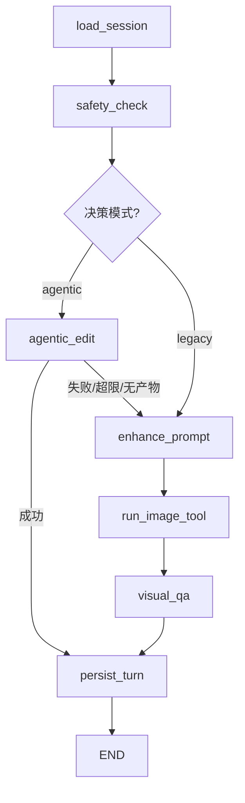
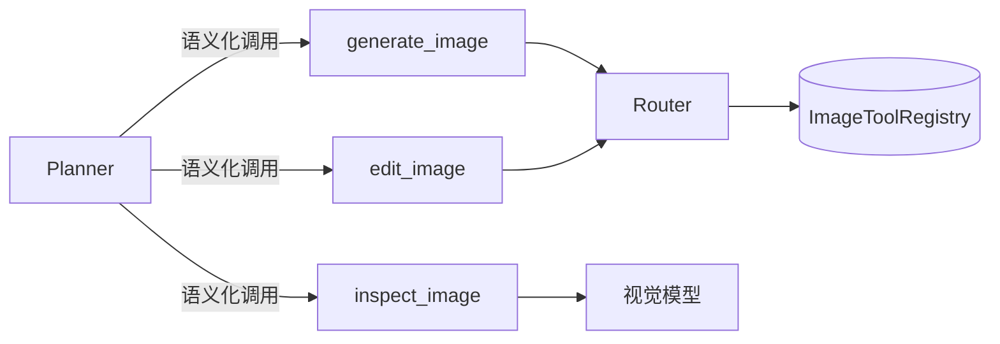
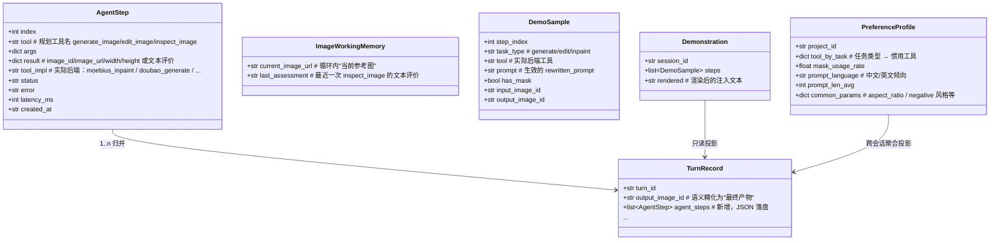

# 基于 aisuite 的 Agentic 多步图像编辑 设计文档

## 1. 设计目的

### 1.1 设计所处的项目状态

本设计面向 `painterAgent`（`feat/local-model-router` 分支，HEAD `ef64921e70e6`，设计时间 2026-08-04）。当前系统是一个 **确定性管道式** 的图像编辑应用：

```text
用户指令 → LangGraph StateGraph：
    load_session → safety_check → enhance_prompt → run_image_tool → visual_qa → persist_turn
```

- 每个 turn 只执行**一次**图像操作：`run_image_tool` 依据 `has_image` / `has_mask` 用启发式规则 `resolve_task_type` 推断任务类型（generate / edit / inpaint），再由 `select_tool` 按注册的 `ToolMeta.priority` 降序选择候选工具（本地候选通常优先，Moebius 只是当前 inpaint 的本地候选之一），失败逐级 fallback。
- 文本 LLM 只用于两个旁路：prompt 增强（`agents/prompt_enhancer.py`）与视觉 QA（`agents/visual_qa.py` —— **当前为空壳**，恒 passed）。
- 存储 `TurnRecord` 是**单输入 / 单输出**模型，每个 turn 只有 `input_image_id` 与 `output_image_id`。
- 异步执行：Dramatiq worker → 事件循环 → `run_workflow`。
- 已有 ollama+qwen3 8B 集成（`docs/ollama-qwen3-provider-router.md`）：通过自建的 `ModelRegistry` / `Capability` / `ModelRoute` 路由框架为 legacy `prompt_enhancer` 提供本地文本增强能力，doubao LLM 兜底。该路由机制仅服务于文本 LLM 层，与本设计的 aisuite LLM 接入层是**两套独立的路由体系**（见 2.10）。

### 1.2 设计期望

引入开源库 **aisuite**（`andrewyng/aisuite`，MIT），在**不改变外部 API 与前端协议**的前提下，为系统新增一种 **agentic 编辑模式**：由 LLM（规划模型）自主决定"调哪个图像工具、按什么顺序、做几次"，从而支持"一句话包含多个连续编辑动作"这类复杂指令。

**定性：以扩展功能为主，附一处配套的轻量重构。**

- **扩展部分（主体）**：新增决策模式、规划工具、图像工作记忆、代理步迹、示范注入、降级护栏 —— 全部为新增能力，既有节点、存储、worker、前端协议零改动，可开关、可降级。
- **重构部分（附属）**：引入统一的 **LLM 接入层**（基于 aisuite 的供应商抽象），使规划/视觉模型以 `provider:model` 可配置，不被当前 doubao 指向束缚。该重构**只作用于新增代码**，不迁移 legacy 路径的 `DoubaoLLM`（见 2.7），故不引入回归风险，不属于对既有实现的改造。

具体期望：

1. 新增一条可开关的**多步执行路径**，与现有确定性路径并存；默认走原路径，行为零变化。
2. agentic 路径**失败自动降级**到原路径，不产生用户可见的失败。
3. 复用既有能力：不重写图片模型接入、路由优先级、本地/云端 fallback、存储、worker、前端轮询协议。
4. 多步执行的中间产物可**回溯**（存储但不要求前端展示）。
5. **遵从用户示范**：用户在确定性模式下"示范一遍"后，agentic 模式能模仿其操作方法/风格完成任务（示范注入，见 2.6）。

### 1.3 使用者与决策权

先回答"这个工具给谁用、谁决定什么"，避免把运维的权限误给用户、或反之。

| 角色 | 使用什么 | 决策权 |
|---|---|---|
| **终端用户**（前端操作者） | 提交指令、选择执行模式、确定性模式下"示范"、消费结果 | **模式选择**（per-turn）：`deterministic` / `agentic` / `auto` |
| **规划模型**（planner LLM） | 直接消费 3 个规划工具（generate / edit / inspect） | 在给定模式下自主拆解步骤，**无权改模式** |
| **运维 / 部署者** | 配置环境变量（供应商、模型、开关、预算） | **能力开关**（全局）：agentic 是否可用、供应商/模型、max_turns 等预算 |
| **API 调用方**（第三方/开发者） | 经 HTTP API 传 `options.mode` 指定模式 | 同终端用户，可编程指定模式 |

**关键结论**：规划工具的直接使用者是规划模型，但"用不用 agentic"的**决定权在终端用户（per-turn）**而非运维（全局）——否则示范学习流程无法成立。因此决策模式必须是"全局能力开关（运维）+ per-turn 模式选择（用户）"两层（见 2.5）。

### 1.4 对既有状态建模后发现的矛盾与空白

| 发现 | 说明 | 对本设计的影响 |
|---|---|---|
| **规划模型"看不见"图片** | aisuite 的工具循环里，工具结果只是文本（`json.dumps`），规划模型看不到编辑后的图片本身 | 必须建立"图像工作记忆"：通过文本化的视觉评价驱动迭代（见 2.3） |
| **`visual_qa` 是空壳** | `agents/visual_qa.py:7` 恒返回 passed，当前系统事实上没有视觉反馈 | agentic 模式的前置依赖：必须实现真实的视觉 QA |
| **`TurnRecord` 单输出** | 多步编辑会产生多张中间图，现有模型存不下 | 引入 `agent_steps` 步迹承载中间产物，`output_image_id` 语义变为"最终产物" |
| **既有 LLM 调用与图片模型共用 ID** | `llm/client.py:31` 把 `DOUBAO_MODEL`（Seedream 图片模型）当文本模型用，且端点硬编码 doubao | 规划/视觉模型必须**独立配置**，且经统一 LLM 接入层以 `provider:model` 寻址（见 2.7），不被当前 doubao 指向束缚 |
| **aisuite 供应商抽象可用** | aisuite 各 provider 把 config 透传给官方 SDK（如 `OpenaiProvider` → `openai.OpenAI(**config)`），可指向任意 OpenAI 兼容端点 | 无需为 doubao 写新 provider；供应商凭据经"供应商配置注册表"从环境变量构建，切换供应商只改 `.env` |
| **模式选择权缺失** | `CreateTurnRequest.options` 存在但 `execute_workflow.send` 不透传（`api.py:367`）；`AGENTIC_EDIT_ENABLED` 只是部署级全局开关 | 模式切换权须归**终端用户**（per-turn），否则示范学习流程（2.6）不成立——用户必须能先切 deterministic"示范"、再切回 agentic（见 1.3 与 2.5） |
| **既有 ollama 路由与 aisuite 是两套独立体系** | `docs/ollama-qwen3-provider-router.md` 已为 legacy `prompt_enhancer` 建立了 `ModelRegistry`/`Capability`/`ModelRoute` 路由框架并接入 ollama+qwen3；aisuite 自带 provider 抽象，两者做法不同 | 两套路由体系**并存**：legacy `prompt_enhance` 走既有路由，新增 planner/vision 走 aisuite。本设计不替换既有路由（见 2.10） |
| **ollama+qwen3 作为 planner 的前置条件** | qwen3 8B 是纯文本模型，经 ollama 的 OpenAI 兼容层暴露；function/tool calling 支持未经验证 | planner 配置为 `ollama:qwen3` 前须实测验证 tool calling 可用；不可用时仅能作为 legacy prompt_enhance 候选，不影响 agentic 整体可用性（可改用其他支持 tool calling 的模型）（见遗留风险 8） |

## 2. 设计逻辑

### 2.1 总体架构

在 LangGraph 中新增节点 `agentic_edit`，与现有节点平级。通过**决策模式（decision mode）**选择执行路径：



- 决策模式 = **能力开关（`AGENTIC_EDIT_ENABLED`，部署层）+ 模式选择（`options.mode`，用户每 turn）**（见 2.5）；`agentic_edit` 内部出错、达到轮次/调用上限、或未产出图片时，**返回降级标记**，条件路由转向 `enhance_prompt`（原路径）。
- `persist_turn` 不变：agentic 路径通过 state 里的 `agent_steps` 字段把步迹写入 turn。

### 2.2 核心问题一：如何复用既有图片工具接入（封装策略）

**问题**：规划模型调用工具时，不能让它接触现有 `ImageToolRegistry` 的底层方法（`generate(req)` / `edit(req)`）——那是面向任务类型的底层 API；规划模型需要的是**语义化**的操作。

**取舍**：选择**薄封装**（thin wrap）而非完全封装或直接暴露。

- 完全封装：为规划模型再造一套抽象，屏蔽 router/registry，会导致重复实现现有 fallback 逻辑。
- 直接暴露：把 `registry.get(tool_name).generate()` 直接给模型，会让模型面向具体后端工具名（如 `moebius_image`/`doubao_image`）等实现细节决策，且丢失 `select_tool` 的优先级选择与 fallback。
- **薄封装（选定）**：定义 3 个**规划工具（planning tool）**，参数语义化，内部把参数映射回现有 `resolve_task_type` → `select_tool` → `registry`，原样保留"按 priority 选择候选、失败逐级 fallback"逻辑。

**与具体后端的解耦原则**：规划工具依赖的是"候选工具注册表 + 优先级路由"这一抽象，而非任何具体工具。Moebius / LaMa / doubao 都只是注册在 `ModelRoute` 下的候选实现，带 `is_local` / `priority` 属性；移除或新增任一后端只需调整注册与优先级，**不改变本设计的任何接口**（规划工具、步迹、示范注入、降级逻辑均与具体后端无关）。未来即便完全去掉 Moebius 本地角色，本设计无需改动。



规划工具对输入做**完整性约束**：`edit_image` 传了 `mask_url` 则按 inpaint 走（本地候选优先），否则按 edit 走（云端）。这保持了 2.4 节 `resolve_task_type` 规则的一致性——规划工具不应创造新的任务类型语义。

### 2.3 核心问题二：规划模型如何"感知"图片（图像工作记忆）

**问题**：工具循环中工具结果只能是文本，规划模型无多模态通道看到编辑产物。若没有视觉反馈，多步编辑就是"盲操作"，无法判断上一步是否达成，质量不可控。

**取舍**：三条候选方案。
1. 让规划模型本身是多模态模型，通过把图片 URL 塞进 tool result —— **不可行**，OpenAI 协议中图片只能作为 message 的 `image_url` content part，工具结果不支持图片。
2. 不做视觉反馈，规划模型盲操作 —— 实现最简，但无法自我纠错，不满足设计期望 3 的质量可控。
3. **文本化的视觉反馈（选定）**：为规划模型提供一个 `inspect_image` 规划工具，内部调用**视觉模型**把图片转成文字评价（如"人物衣服目前是蓝色，背景仍是原样"）。这同时补上了现有 `visual_qa` 空壳的缺口。

由此建立新概念 **图像工作记忆（image working memory）**：一次 turn 的 agentic 循环中，规划模型对"当前图是什么样"的全部认知，都来自工具返回的文本评价。工具返回的 `image_url` 与文本评价共同构成工作记忆的"读"与"写"：`edit_image` 写入新产物，`inspect_image` 读取其文字描述。规划模型的系统提示中必须显式约束：**若要进行有质量要求的下一步，先用 `inspect_image` 确认当前状态**。

### 2.4 核心问题三：多步产物如何落盘（代理步迹）

**问题**：`TurnRecord` 是单输入/单输出。多步编辑的中间图若不落盘，无法回溯、无法重放、无法排查质量。

**取舍**：
- 每个工具调用建一个子 turn —— 会污染会话时间线与 undo/redo 语义（undo 的粒度应是"一次用户指令"），且前端时间线无需展示中间步。**排除**。
- **在 turn 上沉淀步迹（选定）**：保持"一条用户指令 = 一个 turn"不变，新增 `agent_steps`（**代理步迹**），记录每次工具调用的名称、参数、产物 image_id/url、实际使用的后端工具、状态、耗时。`output_image_id` 语义精化为"**最终产物**"（步迹中最后一张成功产出的图片），`persist_turn` 与前端协议**完全不变**。

新概念 **代理步迹（agent trace）**：一次 turn 内规划模型所有工具调用的有序、可回放的记录。它把"多步执行"这个非确定性过程，转存为确定性数据，从而在保持 turn 语义不变的前提下让多步过程可审计。

### 2.5 核心问题四：不可靠性的防护与降级（决策模式）

**问题**：LLM 工具循环可能因模型不支持 tool calling、返回格式错误、达到轮次上限、工具连续失败而不可用/失控；且"用不用 agentic"的决定权应归终端用户（per-turn），而非仅由运维的全局开关决定。

**取舍**：agentic 引入不可靠因素，必须有关键与降级护栏；同时模式选择权应归终端用户（见 1.3），否则示范学习（2.6）不成立。
- **两层开关**：
  - **能力开关（部署层，运维）**：`AGENTIC_EDIT_ENABLED`（默认 `false`）决定 agentic 是否**可用**。关闭时任何 mode 都不会真正进入 agentic。
  - **模式选择（每 turn，用户）**：`CreateTurnRequest.options.mode ∈ {auto, agentic, deterministic}`（默认 `auto`）。
    - `auto`：依能力开关——开启则 agentic（失败降级 legacy），关闭则 deterministic；
    - `agentic`：强制 agentic，能力关闭或执行失败时降级 legacy；
    - `deterministic`：强制走 legacy——用户"上手示范一遍"时的选择。
  - 流转：`options.mode` → `execute_workflow`（透传，现缺）→ `ImageEditState["execution_mode"]` → `route_after_safety` 分派。
- **动态降级**：agentic 执行中遇到下述任一情况即**中止循环、抛降级信号**，由条件路由转入 legacy 路径：
  1. 规划模型调用不可用（401 / 模型不支持工具调用）；
  2. 达到 `AGENTIC_MAX_TURNS` 或工具调用硬上限；
  3. 连续 N 次工具调用全部失败且无一产出；
  4. 循环结束但没有任何成功产物（无最终产物）。

这套机制保证 agentic 模式"最多是白做一次，绝不会更糟"，同时无需双写两套业务逻辑。

### 2.6 核心问题五：agentic 如何遵从用户的示范操作（示范注入）

**问题**：agentic 由规划模型自主决策，结果不必然贴合用户的个人操作方法（工具偏好、prompt 措辞、操作顺序、是否用 mask）。用户对效果不满意时，会在确定性模式下"上手示范一遍"——agentic 应能把这套示范转化为自己的方法。

**取舍**：
- **硬回放**：直接按示范的操作序列照做 —— 示范针对的是旧任务，新指令与之不同，硬回放几乎必然错位。**排除**。
- **纯风格描述**：只在提示词里写一句"参考用户上次的做法"—— 信息损失过大，模型无从模仿具体工具与措辞。**排除**。
- **示范注入（选定）**：把用户在确定性模式下最近一段成功的 turn 序列，**投影**为结构化的"示范记录"，压缩成文本块注入规划模型的系统提示，作为 **few-shot 方法参考**。模型模仿示范的*工具选择、prompt 措辞、操作顺序、mask 用法*，但针对当前指令**重新规划**，不得复用示范中的图片或直接照搬。

新概念 **示范记录（Demonstration Record）**：turn 历史的一个**只读投影**——把"一条用户指令 + 其确定性编辑操作"提炼为 `(指令, 步骤列表)`，每步含 `task_type / 实际后端工具 / 生效 prompt / 是否用 mask / 输入输出图`。**零新增存储**：所有字段已存在于 `TurnRecord`（`user_instruction`、`selected_tool`、`rewritten_prompt`、`mask_image_id`、`input/output_image_id` 等），按需从 `store` 实时计算。

新概念 **示范注入（Demonstration Injection）**：启动 agentic 循环前，从会话 turn 历史中选取示范、渲染为文本块、并入系统提示的机制。它封装三条策略：

| 策略 | v1 实现 |
|---|---|
| 选取 | 当前 turn 之前、最近一段连续成功（`status=succeeded` 且有 `output_image_id`）的确定性 turn，截取最后 `AGENTIC_DEMO_MAX_STEPS` 步 |
| 压缩 | 每步序列化为一行 `工具\|任务类型\|prompt 摘要\|has_mask\|输出图 id`，控制注入长度 |
| 注入 | 系统提示追加"用户示范方法"段落 + 显式约束规则（见 4.4 规则 4） |

**与既有机制的关系**：示范只作用于**提示层**，不改动路由与工具层——因为 `select` 的优先级已决定候选工具选择（本地候选优先，由 `ModelRoute.priority` 表达），工具偏好本质上已由路由体现，示范补充的是路由表达不出的**措辞、顺序与 mask 习惯**。因此示范注入不新增任何工具，也不改变 `resolve_task_type` 语义，与核心问题一/二的薄封装、图像工作记忆正交。

**已知局限**：示范选取须排除"agentic 降级产生的 legacy turn"——本设计已在 4.6 建议 `TurnRecord` 记录 `execution_mode`，据此即可精确过滤；偏好聚合（2.8）同样只统计用户主动的确定性 turn。

### 2.7 核心问题六：规划/视觉模型的供应商如何可配置（统一 LLM 接入层）

**问题**：agentic 循环（规划模型）与视觉 QA（`inspect_image`）都依赖"文本/视觉 LLM"。若把端点写死在 doubao/ARK 上，设计就再次被当前暂时指向束缚；用户可能切换任意 aisuite 支持的供应商（OpenAI / Google / Ollama 本地 / ...）。

**取舍**：
- **硬编码 doubao 端点**：代码里直接写 ARK `base_url` + `doubao-seed-...` —— 绑定当前指向，换供应商要改代码。**排除**。
- **复用 aisuite 的供应商抽象（选定）**：模型统一以 aisuite 约定的 `provider:model` 标识（如 `openai:doubao-seed-1-6-250615`、`google:gemini-2.0-flash`、`ollama:qwen3`），凭据经"供应商配置注册表"从环境变量构建。planner 与视觉 QA 只消费 `provider:model` 字符串，与具体供应商解耦；默认值指向 doubao 只是当前部署的选择，**不是设计约束**。

新概念 **LLM 接入层（LLM access layer）**：基于 aisuite `Client` 的、供应商无关的模型调用抽象。规划循环经 `client.chat.completions.create`（带 `tools` + `max_turns`，aisuite 内置 tool_runner），视觉 QA 经同 API 的多模态消息；两者都以 `provider:model` 寻址，落地为 `llm/aisuite_client.py`。

新概念 **供应商配置注册表（provider config registry）**：从环境变量构建各供应商的 `api_key`/`base_url` 字典（如 `ARK_API_KEY`+`ARK_BASE_URL` → openai 供应商），供 aisuite `Client` 一次性配置。新增或切换供应商 = **只改 `.env`，不改任何代码与接口**。

**与既有 `DoubaoLLM` 的关系**：`llm/client.py` 的 `DoubaoLLM` 是遗留直连客户端，服务于 legacy 路径的 `prompt_enhancer`，本设计**不改动它**（避免 legacy 行为回归）；所有新增代码（planner、视觉 QA）一律走 LLM 接入层。由此形成的"双 LLM 客户端"是**过渡态**，记为已知债务：未来若彻底移除 doubao 依赖，再把 legacy 文本调用迁移到接入层、退役 `DoubaoLLM`（见 5 遗留风险 5）。

**与既有 ollama 路由的关系**：本设计之前，`docs/ollama-qwen3-provider-router.md` 已为 legacy `prompt_enhancer` 建立了独立的 `ModelRegistry`/`Capability`/`ModelRoute` 路由框架。LLM 接入层**不替换**该路由——两套体系并存，各司其职（详见 2.10）。

### 2.8 核心问题七：用户使用偏好是否有记忆（偏好记忆）

**问题**：2.6 的示范注入只取**会话内**最近成功的 turn，**跨会话无记忆**。而用户的操作习惯（惯用工具、惯用 mask、prompt 语言/长度、惯用参数）是**跨会话稳定**的——若只靠会话内示范，新会话里 agentic 会"忘了"用户的长期倾向，示范学习的价值大打折扣。

**取舍**：
- **显式偏好设置**：做偏好设置 UI、用户手动声明"我偏好 X"—— 可靠但重，需要新存储与交互，且用户通常不愿主动声明。**v1 排除**。
- **长期偏好投影（选定）**：把"偏好"建模为项目 turn 历史的**聚合投影**——从 `project_id` 下全部**用户主动的确定性 turn**（依 `execution_mode=deterministic` 过滤）统计稳定倾向。与示范注入同层（提示层），仍是只读投影、可加进程内缓存，不新增存储表。

由此建立**记忆分层**：一次 agentic 循环看到两类上下文——
- **工作记忆（working memory）**：会话内最近的示范记录（具体方法，2.6）；
- **长期记忆（long-term memory）**：跨会话聚合的偏好档案（稳定倾向，本节）。

两者经同一注入通道进入系统提示：偏好在前（全局约束，如"用户一贯用 mask 做局部重绘、prompt 用中文描述"），示范在后（最近的具体参考）。

新概念 **偏好档案（Preference Profile）**：项目级稳定使用倾向的聚合描述，投影自项目 turn 历史，含 `任务类型→惯用工具`、`mask 使用率`、`prompt 语言/长度倾向`、`惯用参数`（如 `aspect_ratio`、negative prompt 风格）。**零新增存储**（仅可加进程内缓存）。

**与示范注入的分工**：示范回答"最近一次怎么做"（few-shot 具体步骤），偏好回答"一贯怎么做"（few-shot 风格统计）。前者随会话漂移，后者跨会话稳定；两者都只作用于提示层，不触碰路由/工具层，与 2.2 解耦原则一致。

**范围控制**：v1 只聚合**用户主动的确定性 turn**（依 `execution_mode=deterministic` 过滤），排除 agentic 及其降级 turn，避免"系统自己教自己"；聚合维度限定 4 类，不过度设计；仅在有效样本 ≥ `AGENTIC_PREFERENCE_MIN_TURNS` 时才注入，样本不足静默跳过。

### 2.9 封装策略总结

| 层面 | 策略 |
|---|---|
| 规划工具 → 图片模型 | 薄封装：语义化参数，内部委托现有 router/registry |
| 规划工具 → 具体后端 | 解耦：只依赖"候选注册 + 优先级路由"抽象，与 Moebius/LaMa/doubao 实现无关，可随意增删后端 |
| agentic_edit → aisuite | 直接依赖：`Client.chat.completions.create(tools=..., max_turns=...)` 作为工具循环引擎 |
| agentic_edit → 存储 | 走既有 `store.update_turn(agent_steps=...)`，不新建存储通道 |
| 示范注入 → turn 历史 | 只读投影：不新增持久化，从 `store` 实时计算 |
| 偏好档案 → turn 历史 | 只读投影（跨会话聚合，可进程内缓存），不新增存储表 |
| 规划/视觉模型 → aisuite | 统一 LLM 接入层（`llm/aisuite_client.py`），`provider:model` 配置化，供应商可切换 |
| 规划模型 / 视觉模型 | 独立配置项，不污染现有 `DoubaoLLM`（其为 legacy 遗留实现） |
| LLM 接入层 → 既有 ollama 路由 | 并存不替换：LLM 接入层服务 planner/vision（新增能力），既有路由服务 prompt_enhance（legacy 能力），见 2.10 |

### 2.10 与既有 ollama 路由的关系（两套路由体系并存）

**背景**：本设计之前，`docs/ollama-qwen3-provider-router.md` 已为 legacy `prompt_enhancer` 建立了统一的 provider 路由机制（`ModelRegistry` / `Capability` / `ModelRoute` / `invoke_with_fallback`），并接入了 `ollama+qwen3:8b` 作为本地文本增强候选，doubao LLM 兜底。该设计与本设计在 LLM 接入层的做法不同——前者自建路由框架，后者依赖 aisuite 的 provider 抽象。

**本设计的立场**：两套路由体系**并存，不互相替换**。

| 路由体系 | 定义文档 | 服务对象 | 服务的能力 | 供应商/模型 |
|---|---|---|---|---|
| 既有 `ModelRegistry` 路由 | `docs/ollama-qwen3-provider-router.md` | legacy `prompt_enhancer` | `prompt_enhance` | ollama+qwen3 / doubao LLM（经 `TEXT_LLM_ORDER` 配置优先级） |
| 新增 aisuite LLM 接入层 | 本文档 2.7 | agentic planner + visual QA | planner（工具循环）、`visual_qa`（多模态问答） | 任意 aisuite 支持的 `provider:model` |

**并存原因**：

1. aisuite LLM 接入层是**本设计的附属重构**，只作用于新增代码（planner / vision QA），不应迁移 legacy `prompt_enhancer`（零回归风险原则）。
2. 既有 ollama 路由已稳定服务于 prompt_enhance，替换它无功能收益，只增加风险。
3. 两套体系服务的**能力维度不同**：既有路由覆盖 `prompt_enhance`（纯文本增强），aisuite 接入层覆盖 planner（需 tool/function calling）与 `visual_qa`（需图像输入）。ollama+qwen3 可作为 prompt_enhance 候选，但**不一定能当 planner**（取决于 tool calling 支持，见遗留风险 8）。

**ollama 在两套体系中的角色**：

- **既有路由**：`OllamaLLM` 作为 `TextLLM` 协议实现，经 `TEXT_LLM_ORDER` 配置优先级参与 prompt_enhance 候选，doubao LLM 兜底。不可用时由 `invoke_with_fallback` 自动跳过。
- **aisuite 接入层**：ollama 作为 aisuite 的一个 provider（`ollama:qwen3` 或 `ollama:llama3.1` 等），可用于 planner——前提是所选模型支持 function/tool calling。若 qwen3 8B 不支持 tool calling，则 planner 不应配置为 `ollama:qwen3`，此时 ollama 仍经既有路由服务 prompt_enhance，两者的可用性互不依赖。ollama 不可用作 vision 模型（qwen3 8B 无图像输入能力）。

**未来收敛路径**：两套体系并存是 2.7 所述"双 LLM 客户端"过渡态的具体表现。若未来满足以下条件，可将 legacy prompt_enhance 也迁移到 aisuite LLM 接入层，届时退役既有 `ModelRegistry` 路由框架：

1. prompt_enhance 的候选模型均已在 aisuite 中可用；
2. prompt_enhance 不需要 tool calling（与 planner 不同），经 aisuite `chat.completions` 即可；
3. 既有路由的 `TEXT_LLM_ORDER` 优先级等行为可经 aisuite 配置等价表达。

迁移完成后，`DoubaoLLM`、`OllamaLLM`、`ModelRegistry`、`Capability`、`ModelRoute` 等均可退役，系统只剩一套 LLM 接入层。此迁移**不在本设计范围内**。

## 3. 核心数据结构

### 3.1 概念 → 数据成员映射



### 3.2 关键定义

**`AgentStep`**（新，pydantic `BaseModel`，定义于 `models.py`）

```python
class AgentStep(BaseModel):
    index: int                 # 步序号（1 起）
    tool: str                  # 规划工具名
    args: dict = Field(default_factory=dict)
    result: dict = Field(default_factory=dict)   # 产物/评价
    tool_impl: str = ""        # 实际后端工具名（透传规划工具的 selected_tool）
    status: str = "succeeded"  # succeeded | failed | denied
    error: str = ""
    latency_ms: int = 0
    created_at: str = Field(default_factory=lambda: datetime.utcnow().isoformat())
```

**`TurnRecord`** 新增字段：

```python
agent_steps: list[AgentStep] = Field(default_factory=list)
```

- 双存储实现均支持：MemoryStore `update_turn` 直接 setattr；PostgresStore `update_turn` 对 `dict/list` 自动 `json.dumps`（`storage.py:443`），只需建表时加列。

**配置（`config.py` 新增 `AgenticConfig`）**

| 配置 | 环境变量 | 默认 | 说明 |
|---|---|---|---|
| enabled | `AGENTIC_EDIT_ENABLED` | `false` | 能力开关（部署层）：agentic 是否可用；关闭时任何 `mode` 都不会真正进入 agentic |
| planner_model | `AGENTIC_MODEL` | `openai:doubao-seed-1-6-250615` | 规划模型，`provider:model` 格式（默认值仅示例），需支持 function calling；切换供应商只改此项+凭据 |
| max_turns | `AGENTIC_MAX_TURNS` | `5` | aisuite tool_runner 轮次上限（`create()` 的 `max_turns` 参数） |
| max_tool_calls | `AGENTIC_MAX_TOOL_CALLS` | `8` | 工具调用硬上限 |
| vision_model | `VISION_MODEL` | `openai:doubao-1-5-vision-pro-32k-250115` | 视觉 QA 模型，`provider:model` 格式（默认值仅示例），需支持图像输入 |
| vision_retries | `AGENTIC_CONSECUTIVE_FAIL_LIMIT` | `3` | 连续失败即降级 |
| demo_enabled | `AGENTIC_DEMO_ENABLED` | `true` | 是否启用示范注入（仅在 agentic 开启时生效） |
| demo_max_steps | `AGENTIC_DEMO_MAX_STEPS` | `6` | 示范记录最大步数（控制注入长度） |
| pref_enabled | `AGENTIC_PREFERENCE_ENABLED` | `true` | 是否启用偏好记忆（跨会话聚合注入） |
| pref_min_turns | `AGENTIC_PREFERENCE_MIN_TURNS` | `3` | 有效样本不足此数时不注入偏好档案 |

> 各供应商凭据经 `build_provider_configs()`（见 4.5）从环境变量构建，与模型 ID 相互独立；`planner_model` / `vision_model` 中的 `provider` 前缀须与凭据注册的供应商一致。

## 4. 接口定义

### 4.1 规划工具（内部接口，规划模型可见）

定义于新文件 `src/painterAgent/tools/agent_tools.py`，为 `PlanningTools` 类的三个 async 方法。aisuite 通过 `docstring_parser` 解析 docstring 生成 OpenAI tool schema，`inspect.signature` 提取参数类型。返回**短 JSON**（URL 而非字节）。

```python
async def generate_image(prompt: str, aspect_ratio: str = "2K") -> dict:
    """文生图：仅依据文本描述新生成一张图片。
    Args:
        prompt (str): 图片内容描述（英文优先）。
        aspect_ratio (str): 尺寸，默认 "2K"。
    Returns: {"image_id", "image_url", "width", "height"}。
    """
    # 内部：resolve_task_type(False, False)="generate" → select_tool → registry

async def edit_image(image_url: str, prompt: str, mask_url: str = "", scope: str = "full") -> dict:
    """编辑既有图片：可按用户指令整体重绘，或传入 mask_url 仅重绘遮罩区域。
    Args:
        image_url (str): 上一步产出的图片 URL（即工作记忆中的当前图）。
        prompt (str): 编辑指令描述。
        mask_url (str, optional): 局部重绘遮罩 URL；提供则按 inpaint 处理（本地优先）。
        scope (str, optional): 编辑范围，仅用于语义提示，默认 "full"。
    Returns: {"image_id", "image_url", "width", "height"}。
    """
    # 内部：has_mask=bool(mask_url) → "inpaint"/"edit" → select_tool → registry

async def inspect_image(image_url: str, question: str) -> str:
    """查看图片并返回文字化描述，用于评估上一步编辑是否达标。
    Args:
        image_url (str): 要检查的图片 URL。
        question (str): 针对该图的检查问题。
    Returns: 文字评价（如"人物衣服仍是蓝色，背景未改变"）。
    """
    # 内部：经 LLM 接入层调 config.agentic.vision_model（provider:model），把图片 URL 作为多模态消息，返回文本
```

**关系总结**：`generate_image` 建立新图，`edit_image` 在既有图上迭代出新图，`inspect_image` 把图转为文字——三者共同维护"图像工作记忆"：编辑类工具**写入**新产物，检查类工具**读取**其文字描述。

### 4.2 agentic 循环（对外接口，workflow 节点）

定义于新文件 `src/painterAgent/agents/agentic_editor.py`：

```python
async def run_agentic_edit(state: ImageEditState) -> dict:
    """agentic_edit 节点：用规划模型 + aisuite 工具循环执行多步编辑。

    流程：取示范记录（若启用）→ 渲染注入系统提示 → 组装规划工具 → 跑循环。
    返回值：
      {"output_image_id", "output_image_url", "agent_steps", "agent_reply",
       "selected_tool", "model_provider", "model_name", "model_params",
       "degraded"}   # degraded=True 表示需降级到 legacy 路径
    """
```

内部使用 aisuite（v0.1.14 实际 API，无 `Agent`/`Runner` 类，工具循环内置于 `create()`）：

```python
system_prompt = AGENTIC_SYSTEM_PROMPT
if config.agentic.pref_enabled:                        # 长期记忆：跨会话偏好（在前）
    profile = build_preference_profile(state["project_id"],
                                       min_turns=config.agentic.pref_min_turns)
    if profile:
        system_prompt += "\n\n" + render_preference_prompt(profile)
if config.agentic.demo_enabled:                        # 工作记忆：会话内示范（在后）
    demo = build_demonstration(state["session_id"], state["turn_id"],
                               max_steps=config.agentic.demo_max_steps)
    if demo and demo.rendered:
        system_prompt += demo.rendered

tools_wrapper = PlanningTools(session_id, turn_id, enabled_providers)
client = get_client()                                  # LLM 接入层（惰性单例）
response = client.chat.completions.create(
    model=config.agentic.planner_model,
    messages=[{"role": "user", "content": instruction}],
    tools=[tools_wrapper.generate_image,
           tools_wrapper.edit_image,
           tools_wrapper.inspect_image],
    max_turns=config.agentic.max_turns,                # aisuite 内置 tool_runner
)
```

提取步迹：从 `response.choices[0].intermediate_messages` 遍历 tool_calls 与 tool results，匹配为 `list[AgentStep]`。最终产物 = 步迹中最后一张成功产出的图片。

### 4.3 示范注入（内部接口）

定义于新文件 `src/painterAgent/agents/demo_learning.py`：

```python
def build_demonstration(session_id: str, before_turn_id: str,
                        max_steps: int = 6) -> Demonstration | None:
    """把用户最近的确定性编辑操作投影为示范记录。

    Args:
        session_id (str): 会话 ID，用于取 turn 历史。
        before_turn_id (str): 当前 turn ID；示范取其之前的 turn。
        max_steps (int): 示范最多包含的步数（截取最近 N 步）。
    Returns: Demonstration（含 steps 与渲染文本）或 None（无符合条件的示范）。
    """
    # 从 store.get_session_with_turns 取 turns，筛选 status=succeeded 且
    # 有 output_image_id 的连续段，回溯到第一个不满足条件的 turn 为止。

def render_demo_prompt(demo: Demonstration) -> str:
    """把示范记录渲染为注入文本块（few-shot 方法参考）。

    每步序列化一行：`步骤i: 任务类型|工具|prompt 摘要|has_mask|输出图id`，
    块首加一句"以下是用户最近示范的编辑方法，请模仿其工具选择与措辞，但
    针对当前指令重新规划，不得复用示范中的图片"。
    """

def build_preference_profile(project_id: str,
                             min_turns: int = 3) -> PreferenceProfile | None:
    """把项目内用户主动的确定性 turn 聚合为偏好档案（长期记忆）。

    Args:
        project_id (str): 项目 ID，聚合范围。
        min_turns (int): 有效样本下限；不足返回 None（不注入）。
    Returns: PreferenceProfile（含聚合统计）或 None。
    """
    # 依 execution_mode=deterministic 过滤，统计 tool_by_task / mask_usage_rate /
    # prompt 语言与长度 / 惯用参数；可加进程内缓存。

def render_preference_prompt(profile: PreferenceProfile) -> str:
    """把偏好档案渲染为注入文本块（全局风格约束）。

    如"用户一贯使用 mask 做局部重绘、prompt 以中文描述、生成尺寸偏好 2K"。
    """
```

**关系总结**：`build_demonstration` / `render_demo_prompt` 构成**工作记忆**（会话内示范），`build_preference_profile` / `render_preference_prompt` 构成**长期记忆**（跨会话偏好）；两者同属"记忆分层"，经 `run_agentic_edit` 依次注入系统提示（偏好在前、示范在后），都只作用于提示层、不触碰路由/工具层，与图像工作记忆正交。

### 4.4 系统提示（规划模型契约）

`AGENTIC_SYSTEM_PROMPT`（`agentic_editor.py` 内常量）约束五件事：

1. 复杂指令应**拆解为多步**，每步一次工具调用，输出图用上一步的 `image_url`；
2. 有质量要求的步骤前，先调用 `inspect_image` 确认当前状态，再决定下一步；
3. 全部完成、产出**最终产物**后，用中文向用户总结最终结果，不得再调用工具；
4. 若提示中提供"用户示范方法"段落：**模仿其工具选择、prompt 措辞与操作顺序**，但必须针对当前指令重新规划，**不得复用示范中的图片**、不得照搬示范步骤；
5. 若提示中提供"用户偏好"段落：将其视为该用户的**一贯风格约束**（惯用工具、mask 习惯、prompt 语言），优先遵从；与示范段落冲突时，示范（最近具体方法）优先于偏好（一般倾向）。

### 4.5 LLM 接入层接口

定义于新文件 `src/painterAgent/llm/aisuite_client.py`：

```python
def build_provider_configs() -> dict[str, dict]:
    """从环境变量构建 aisuite Client 的 provider_configs（供应商配置注册表）。

    映射关系（环境变量 → provider_config）：
      ARK_API_KEY + ARK_BASE_URL → {"openai": {"api_key": ..., "base_url": ...}}
      OLLAMA_ENABLED=true → ollama provider 配置（base_url 取自 OLLAMA_BASE_URL，
        默认 http://localhost:11434/v1，无 api_key；ollama 暴露 OpenAI 兼容接口）
      GOOGLE_API_KEY → {"google": {"api_key": ...}}
    新增供应商只加环境变量，不改代码。具体 provider 名称依 aisuite 支持的供应商列表。
    """

def get_client() -> aisuite.Client:
    """惰性单例：aiseuite Client，复用 provider_configs（进程内缓存）。"""

async def vision_answer(model: str, image_url: str, question: str) -> str:
    """经 LLM 接入层做多模态问答（供 inspect_image 复用）。

    Args:
        model (str): `provider:model` 标识，须支持图像输入。
        image_url (str): 图片 URL。
        question (str): 针对该图的检查问题。
    Returns: 文字评价。
    """
```

**关系总结**：`build_provider_configs` 是"供应商配置注册表"的实现，`get_client` 提供共享 `Client`（惰性单例），`vision_answer` 是视觉 QA 的统一入口——三者构成 **LLM 接入层**：规划循环经 `client.chat.completions.create(tools=..., max_turns=...)` 消费同一 `Client`，视觉 QA 经 `vision_answer`，都以 `provider:model` 寻址，供应商可切换而不改业务代码。

### 4.6 配置与依赖接口

- 配置：`AgenticConfig`（见 3.2），`.env.example` 补充全部环境变量说明。
- 依赖：`pyproject.toml` 新增 `aisuite`（openai SDK 已存在，`aisuite[openai]` 即 base+openai）。
- workflow：`build_workflow()` 新增节点 `agentic_edit` 与条件路由——`route_after_safety` 依 `state["execution_mode"]`（用户每 turn 选择）+ `config.agentic.enabled`（能力开关）分派；`agentic_edit` 返回 `degraded=True` 时转 `enhance_prompt`。
- API/worker：`execute_workflow.send` 透传 `req.options.get("mode", "auto")`（`api.py:367` 现缺，需补）→ `ImageEditState["execution_mode"]`。
- 存储：`turns` 表新增 `agent_steps` JSON 列（Postgres 建表 SQL 一并给出）；建议一并记录 `execution_mode`（用户选择 + 是否实际降级），可精确区分"用户示范 turn"与"降级 turn"（消解遗留风险 4）。示范注入本身**不加任何存储字段**。

### 4.7 前端协议

**实现状态**：后端链路已完整（`options.mode` → `api.py` 透传 → `worker.py` → `workflow.py` 分派），模式选择控件**尚未实现**（v1 待办）。

**最小变更**：新增一个**执行模式选择控件**（确定性 / 自动 / agentic），随创建 turn 的请求经 `CreateTurnRequest.options.mode` 发送——API 请求/响应形状均不变（`options` 已存在），属纯前端增量。`TurnDetailResponse` 已暴露 `agent_steps` 和 `execution_mode` 字段，v1 前端可不消费。

**未实现前端控件的影响**：
- 默认行为（不传 `mode` → `"auto"`）完全正确：`AGENTIC_EDIT_ENABLED=false` 时走 legacy，开启时走 agentic（含降级）。
- **阻塞**的功能路径：用户无法通过 UI 选择 `deterministic` 模式进行"示范"操作，因此示范注入（2.6）的端到端链路无法从前端触发。API 调用方可通过 `options.mode` 编程指定，不受影响。
- 实现控件后即可解锁完整功能链路（见 6.3 验收标准"前端模式控件"）。

## 5. 一致性校验

**概念一致性**：全文统一使用"规划模型 / 规划工具 / 图像工作记忆 / 代理步迹 / 最终产物 / 决策模式 / 示范记录 / 示范注入 / LLM 接入层 / 供应商配置注册表 / 记忆分层 / 偏好档案 / 两套路由体系"十三个概念；"规划工具"与底层"图片工具（ImageToolRegistry 成员）"严格区分，不与"任务类型（generate/edit/inpaint）"混用；"示范记录"是 turn 历史的投影，不与"代理步迹"（agentic 自身执行记录）混为一谈；"工作记忆（示范）"与"长期记忆（偏好档案）"分属不同聚合范围（会话内 vs 跨会话），不混用；"LLM 接入层（aisuite）"与"既有 ModelRegistry 路由"是两套独立体系（见 2.10），不混用。

**接口完备性**：
- 设计逻辑 2.5 的 4 个降级触发点均有对应实现路径：调用异常 → 异常捕获转 degraded；轮次/调用上限 → `max_turns` 自动截断 + `max_tool_calls` 检查计数；连续失败 → 步迹中失败计数；无最终产物 → 检查 `output_image_id`。
- `persist_turn` 读取 `state["agent_steps"]` 并写入 turn，与 `output_image_id` 精化语义一致。
- 决策模式（两层开关）所有输入事件已覆盖：`mode ∈ {auto, agentic, deterministic}` × `enabled ∈ {on, off}` 的六种组合均有确定去向（auto×off→legacy、agentic×off→降级 legacy、deterministic×any→legacy 等）；状态机四态（agentic 成功 / 降级 / legacy 正常 / legacy 失败）完备。
- 示范注入的每条策略均有对应接口：选取 → `build_demonstration`；压缩/渲染 → `render_demo_prompt`；注入 → `run_agentic_edit` 拼接 system_prompt。
- 偏好记忆的每个环节均有对应接口：聚合 → `build_preference_profile`；渲染 → `render_preference_prompt`；注入 → `run_agentic_edit`（偏好在前、示范在后）；范围控制 → `AGENTIC_PREFERENCE_ENABLED` / `AGENTIC_PREFERENCE_MIN_TURNS`。
- LLM 接入层的每个职责均有对应接口：供应商配置 → `build_provider_configs`；共享客户端 → `get_client`；视觉 QA → `vision_answer`；规划循环 → `client.chat.completions.create(tools=..., max_turns=...)`。
- 模式流转的每个环节均有对应接口：用户选择 → `options.mode`；透传 → `execute_workflow` 参数；入态 → `ImageEditState["execution_mode"]`；分派 → `route_after_safety`。

**层次一致性**：规划工具只承担"语义化 + 映射"职责，不重复实现图片模型调用、优先级路由与 fallback（这些仍在 `router.py` / registry 层）；`agentic_editor.py` 不触碰存储细节（经 `store.update_turn`）；视觉 QA 不内嵌在规划工具里重复实现，而是复用 LLM 接入层的 `vision_answer`；示范注入只作用于提示层，不新增工具、不改变 `resolve_task_type` 语义；**本设计不承担任何具体后端的职责**——Moebius/LaMa/doubao 属于候选注册层，移除它们不触及本设计任何接口（见 2.2 解耦原则）；**供应商选择属于配置层**，`planner_model`/`vision_model` 以 `provider:model` 寻址，接口不硬编码任何供应商；**LLM 接入层（aisuite）与既有 ModelRegistry 路由分层**：前者服务 planner/vision（新增能力），后者服务 prompt_enhance（legacy 能力），两套体系在同一 worker 进程内共存但互不调用（见 2.10）。

**可靠性 / 安全性**：
- 成本防护：`max_turns` + 调用硬上限 + 连续失败降级，防止失控循环烧钱/占 GPU。
- GPU 约束不破坏：agentic 模式仍经同一 worker，`_cleanup_gpu()` 在 workflow 结束后生效；`AGENTIC_MAX_TOOL_CALLS` 同时限制本地候选工具推理次数（若未来移除本地后端，该约束自然退化为只限制云端调用）。
- 工具白名单：规划模型只接触 3 个规划工具，无 shell/git 等风险工具，不需要额外 tool_policy。
- 示范注入的输入全部来自本会话自身 turn 历史，无外部数据引入，不扩大攻击面；注入长度受 `AGENTIC_DEMO_MAX_STEPS` 限制，不撑爆提示词。

**可测试性 / 可调试性**：agentic 路径的每个工具调用都会落入 `agent_steps` 并随 turn 持久化；`ModelCallRecord` 机制可记录规划模型与视觉模型的调用（`purpose="agentic_planner"` / `"visual_qa"`），便于复现与排查；示范与偏好注入均可在提示词日志中回看（注入文本即 `render_demo_prompt` / `render_preference_prompt` 输出），便于验证"记忆"是否被正确选取。

**遗留风险（需实测，不阻塞编码）**：
1. 所选 `AGENTIC_MODEL` 是否支持 function calling、`VISION_MODEL` 是否支持图像输入 —— 需在实现阶段用最小脚本验证（具体模型由配置决定，验证只针对当前配置值）。
2. aisuite 各 provider 对目标端点的兼容性（如 `OpenaiProvider` 对 ARK 的 `base_url` 透传、tool calling 回包解析）—— 若目标端点回包与供应商官方 SDK 有差异，需在 `build_provider_configs` 侧适配或为该端点注册自定义 provider。
3. `visual_qa` 空壳的实现是本设计的前置依赖，若 `VISION_MODEL` 不可用，`inspect_image` 将退化为仅返回占位文本，agentic 质量保证失效 —— 此时应保持 `AGENTIC_EDIT_ENABLED=false`。
4. v1 示范选取以"连续成功即视为示范"为启发式；若需精确区分"用户主动示范的 turn"与"agentic 降级产生的 legacy turn"，给 `TurnRecord` 记录 `execution_mode` 后即可按模式过滤（本设计已在 4.6 建议一并记录；偏好档案同样依赖该字段过滤）。
5. **双 LLM 客户端为过渡态**：legacy 路径仍用 `DoubaoLLM`（不动），新增代码走 LLM 接入层；若未来彻底移除 doubao 依赖，需将 legacy 文本调用迁移到接入层并退役 `DoubaoLLM`。
6. **偏好聚合的有效性**：偏好档案是隐式统计，样本少（< `AGENTIC_PREFERENCE_MIN_TURNS`）时不注入；且只统计确定性 turn，用户若长期只用 agentic 则无偏好样本 —— 属于可接受的冷启动局限，不阻塞。
7. **注入长度**：偏好 + 示范 + 系统提示三段拼接会增长提示词；偏好聚合维度限定 4 类、示范步数由 `AGENTIC_DEMO_MAX_STEPS` 约束，需实测确认在上下文窗口内。
8. **ollama+qwen3 作为 planner 的 tool calling 支持**：qwen3 8B 经 ollama 的 OpenAI 兼容层对 function/tool calling 的支持需实测验证。若不支持，planner **不可**配置为 `ollama:qwen3`，应使用经确认支持 tool calling 的模型（如 doubao-seed-1-6 等云端模型）。此时 ollama 仍可经既有路由（`docs/ollama-qwen3-provider-router.md`）服务 legacy `prompt_enhance`，不受影响。同理，若用户希望通过 ollama 运行其他支持 tool calling 的本地模型（如 llama3.1、qwen2.5 等），也需逐模型验证。

## 6. 验收标准

> 与项目既有做法一致（`TODOs.md` 的 4 条功能验证链路），设计时就明确验收，把每个设计要素映射为可验证的链路与断言。链路 1–4 为**回归**（agentic 关闭时必须原样通过），链路 5–9 为**新功能验收**。通过标准：每条链路的断言全部满足。

### 6.1 回归验收（决策模式默认不变）

链路 1 文生图 / 链路 2 图生图 / 链路 3 版本分支 / 链路 4 undo-redo —— 配置全默认（`AGENTIC_EDIT_ENABLED=false`、不带 `options.mode`），按 `TODOs.md` 原断言执行，行为与原实现完全一致。

### 6.2 新功能验收链路

| # | 验收链路 | 操作 | 断言 |
|---|---|---|---|
| 5 | agentic 多步编辑 | `AGENTIC_EDIT_ENABLED=true`；`POST /sessions/{id}/execute {"instruction":"把背景换成海边，并把人物衣服改成红色","options":{"mode":"agentic"}}` | turn 成功；`agent_steps` ≥ 2 且覆盖 edit/inpaint；`output_image_id` = 最后一张产物；最终图同时满足两个修改 |
| 6 | 示范注入 | 先 `mode=deterministic` 示范（如"用 mask 只改人物衣服"）；再 `mode=agentic` 发同类指令 | 提示词日志含"用户示范方法"段；agentic 的工具选择/是否用 mask 贴合示范；未复用示范中的图片 |
| 7 | 偏好记忆（跨会话） | 会话 A 用 deterministic 完成 ≥`AGENTIC_PREFERENCE_MIN_TURNS` 个 turn（如均 mask 局部重绘）；新建会话 B 发 agentic 指令 | 提示词日志含"用户偏好"段且聚合统计与历史一致；样本不足时**不**注入 |
| 8 | 降级护栏 | 故意配错 `AGENTIC_MODEL`（不可用/不支持工具调用）；`mode=agentic` 发指令 | turn 仍成功；`execution_mode` 标记为降级；`agent_steps` 为空或仅含失败步；无用户可见失败 |
| 9 | 模式选择（2.5 六种组合） | 依次用 `mode ∈ {auto, agentic, deterministic}` × `enabled ∈ {on, off}` 发指令 | auto×off→legacy、agentic×off→降级 legacy、deterministic×any→legacy、auto×on→agentic、agentic×on→agentic、deterministic×on→legacy |

### 6.3 配置 / 接口级验收

- **供应商可切换**：仅改 `AGENTIC_MODEL` / `VISION_MODEL` 为另一 `provider:model` + 对应凭据（不改代码），链路 5 仍跑通。
- **后端可增删**：移除 Moebius 注册或调低其 priority 后，inpaint 自动落到下一候选，链路 5 仍跑通。
- **步迹可回溯**：`GET /turns/{turn_id}` 返回 `agent_steps`（每步 tool/args/产物/耗时），`output_image_id` = 最终产物。
- **前端模式控件**（待实现）：UI 呈现 确定性 / 自动 / agentic 三态，切换后请求携带对应 `options.mode`。当前默认不传 mode（= auto），后端行为正确；实现控件后解锁示范注入的端到端链路。

### 6.4 说明

- 链路 6/7 依赖 `inspect_image`（`VISION_MODEL` 可用）与 `execution_mode` 记录；若视觉模型不可用，按遗留风险 3 处理（保持 `AGENTIC_EDIT_ENABLED=false`），此时仅验收回归链路 1–4。
- 项目无自动化测试基线，验收以手动/脚本跑链路为准，与现状一致；验收通过后建议把链路 5–9 回写 `TODOs.md` 的验证清单。

### 6.5 既有验证做法的更新

**结论：方法论不变（仍是链路式手动验收），但既有做法需做 4 项配套更新**——本设计复杂度（六种模式组合、降级路径、提示词注入、多供应商配置）已超过纯手动裸跑能充分断言的范围，故对既有做法做最小增强：

| # | 更新项 | 说明 | 时机 |
|---|---|---|---|
| 1 | 回归基线快照 | 实现前先按 `TODOs.md` 链路 1–4 跑一遍并标记通过，作为"默认零变化"的基准 | 实现前 |
| 2 | 观测手段配套 | agentic 链路断言依赖可观测性：偏好/示范注入段需 debug 日志输出；planner/vision 调用经既有 `GET /turns/{id}/model-calls`；`agent_steps` 经 `GET /turns/{id}`。链路 5–9 断言逐条标注观测点 | 实现时 |
| 3 | 链路 9 脚本化（可选） | 六种 `mode × enabled` 组合手动跑易错，建议写成循环调 API 的小脚本（非完整测试框架） | 实现后 |
| 4 | 文档回写 | 验收通过后：`TODOs.md` 增补链路 5–9；`AGENTS.md` Testing 段"4 条链路"改为"9 条链路（回归 1–4 + agentic 5–9）"，并补充 agentic 新配置需重启 worker 生效等注意事项 | 验收后 |

**明确不做**：不引入 pytest / CI / 静态检查——项目现状如此（AGENTS.md 明示），避免把验证实践的范围扩张成工程改造。

## 7. 变更历史

| 日期 | 变更内容 | 原因 |
|---|---|---|
| 2026-08-04 | 初稿：引入 aisuite 实现 agentic 多步编辑模式（决策模式、规划工具、图像工作记忆、代理步迹、降级护栏） | 需求：让系统支持"一条指令包含多个连续编辑动作"的自主规划执行 |
| 2026-08-04 | 新增示范注入：agentic 模式遵从用户在确定性模式下的示范操作（示范记录为 turn 历史只读投影、示范注入机制、`AGENTIC_DEMO_*` 配置、系统提示规则 4） | 需求：用户对 agentic 效果不满意时"上手示范一遍"，agentic 能模仿其操作方法/风格 |
| 2026-08-04 | 与具体后端解耦：全文把 Moebius 相关描述泛化为"候选工具注册 + 优先级路由"抽象，明确规划工具不依赖任何具体后端（Moebius/LaMa/doubao 可随意增删） | 需求：Moebius 仅是当前一个本地工具，后续可能移除，设计不得被其束缚 |
| 2026-08-04 | 与具体供应商解耦 + 重新定性：新增统一 LLM 接入层（`llm/aisuite_client.py`：`build_provider_configs`/`get_client`/`vision_answer`），规划/视觉模型改为 `provider:model` 配置化；设计定性为"以扩展为主、附一处配套轻量重构（LLM 接入层）" | 需求：planner 当前指向 doubao 只是可配置的临时选择，设计不得被其束缚；并澄清本设计是扩展功能而非重构既有实现 |
| 2026-08-04 | 明确使用者与决策权（1.3）；决策模式改两层开关：部署级能力开关 `AGENTIC_EDIT_ENABLED` + 用户每 turn 的 `options.mode ∈ {auto, agentic, deterministic}`（`execute_workflow` 透传、`execution_mode` 入态、`route_after_safety` 分派）；前端新增模式选择控件（最小变更） | 需求：厘清"这个工具给谁用"——模式切换权应归终端用户（per-turn），否则示范学习流程无法成立；并修复 `options` 不透传的缺口 |
| 2026-08-04 | 新增偏好记忆（2.8 核心问题七）：记忆分层（工作记忆=会话内示范 / 长期记忆=跨会话偏好档案）；`build_preference_profile`/`render_preference_prompt`；`AGENTIC_PREFERENCE_*` 配置；系统提示规则 5（偏好在前、示范在后、示范优先于偏好） | 需求：用户使用偏好是否被记忆——目前示范注入仅会话内有效，补一层跨会话稳定的偏好记忆 |
| 2026-08-04 | 新增第 6 章验收标准：回归链路 1–4 + 新功能链路 5–9（多步编辑/示范注入/偏好记忆/降级护栏/模式组合），附配置与接口级验收、说明与回写 TODO 建议 | 需求：验收标准应在设计时就考虑——与项目 `TODOs.md` 链路式验证一致，使设计目标可验证 |
| 2026-08-04 | 6.5 新增"既有验证做法的更新"：明确方法论不变，需配套 4 项更新（回归基线快照 / 观测手段 / 链路 9 脚本化 / 文档回写），并明确不引入 pytest/CI | 需求：澄清既有做法是否需要更新——本设计复杂度超出纯手动裸跑断言能力，需最小配套增强 |
| 2026-08-09 | 整合 ollama 内容：1.1/1.4 注明既有 ollama 路由；2.10 新增"与既有 ollama 路由的关系"（两套体系并存）；4.5 `build_provider_configs` 补 ollama 配置示例；遗留风险 8 ollama+qwen3 作为 planner 的 tool calling 验证；概念/一致性校验相应更新 | 需求：`docs/ollama-qwen3-provider-router.md` 已先行集成 ollama+qwen3，设计文档须澄清两套路由体系的关系、ollama 在 agentic 模式中的角色与约束 |
| 2026-08-09 | 同步实际实现：4.1/4.2/4.5 将 `Agent`+`Runner.run` API 更正为 `Client.chat.completions.create(tools=..., max_turns=...)`（aisuite v0.1.14 实际 API）；2.7/2.9/3.2/5 中所有 `Runner`/`Agent`/`tool_events` 引用同步更新；4.7 前端协议标注模式选择控件"待实现"及影响分析；6.3 验收标准同步；`ToolMeta`→`ModelRoute`、`select_tool`→`select` 等 ollama 路由重构的命名统一 | 需求：实现完成后设计文档落后于代码，需同步实际的 aisuite API 形状与前端实现现状 |
