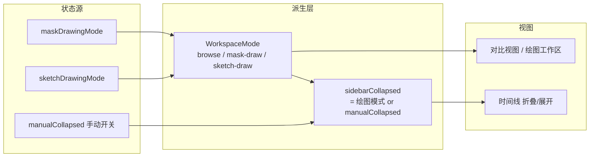
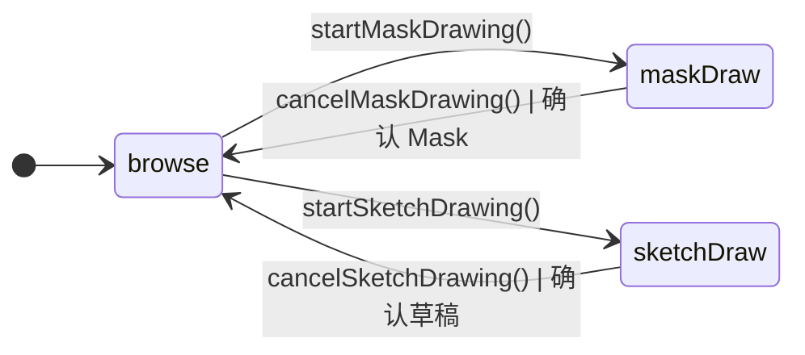

# 前端工作区布局重构设计文档

## 1. 设计目的

### 1.1 定性

这是一次对已有前端布局的**重构 + 交互增强**，不是新增业务模块，也不涉及后端接口。

### 1.2 现状建模

当前主界面（`frontend/src/App.tsx`）是**固定的左右布局**：

```
┌──────── header：标题 + ? / ↩ / ↪ ────────┐
├──────── 时间线 280px ──┬── 主区 ─────────┤
│                        │  输入图片 | 结果图片 │  ← 双栏对比视图 (ImageViewer)
│     编辑历史           │                 │
│      (TurnTimeline)    │                 │
│                        │  当前指令       │
│                        ├─ 底部指令条 ──────┤
│                        │  [选择图片][白板]  │
│                        │  [上传Mask][绘制Mask] 输入框 发送 │
└────────────────────────┴─────────────────┘
```

关键事实：

- 绘图类交互（绘制 Mask、白板）发生时，`MaskCanvas` / `SketchCanvas` 只替换 `ImageViewer` 的「输入图片」**半栏**（`ImageViewer.tsx:235-245`），画布被限制在半个主区宽度。
- 白板画布是 1:1 方形（`SketchCanvas.tsx`，512×512），在窄半栏里被压得极小，绘制体验差。
- 绘制工具栏（画笔/橡皮/颜色/粗细/清空/确认/取消）嵌在画布顶部，而底部指令条在绘制期间整条置灰、不可用，形成**功能与空间的割裂**：画布需要空间却只给一半，指令条占着空间却不可用。
- 底部指令条按钮已达 6~7 个（`InstructionInput.tsx`），拥挤，其中「白板」「绘制 Mask」的交互重心在画布上而不是在指令条里。

### 1.3 期望

1. 进入绘制模式（Mask / 白板）时，画布获得**全幅工作区**，时间线自动让位（折叠），底部指令条退场，绘制成为一个沉浸式任务。
2. 浏览 / 编辑时保留「输入 | 结果」对比视图，并允许用户**手动折叠时间线**释放空间。
3. 布局状态必须**由既有交互状态派生**，不引入独立的第二套状态机，避免漂移。
4. 为后续窄屏响应式预留结构空间（本次不实现）。

### 1.4 矛盾与修正

用户的诉求「需要更好的交互界面」比较模糊，本文将其落地为两点可验证的量化目标：**绘图画布可用宽度从「半个主区」提升到「整个主区」**，以及**绘制期间不再有不可用的 UI 元素**。左右对比视图是为「看前后差异」而设计的，把它用于「创作」（绘图）是本设计要修正的根本矛盾。

### 1.5 项目状态锚点

- 分支：`feat/local-model-router`
- 版本：`69bd892`（`refactor: src/ 布局 + 包名统一为 painterAgent + uv 迁移`）
- 设计时间：2026-08-06
- 基线内还包含未提交的 `WelcomeGuide.tsx` 教程更新

---

## 2. 设计逻辑

### 2.1 核心挑战

设计逻辑围绕 2 个核心问题展开，其余细节不展开。

### 挑战 1：如何让布局切换与既有交互状态保持单一来源？

**结论：布局不是独立状态机，而是由 useSession 既有状态派生的派生链。**

```
useSession.maskDrawingMode / sketchDrawingMode
        │
        ▼
  WorkspaceMode（派生枚举：browse | mask-draw | sketch-draw）
        │
        ├── 视图选择：对比视图  vs  绘图工作区
        └── 时间线折叠：绘图模式强制折叠
```

引入新概念 **WorkspaceMode**，它封装了「主区当前应该展示哪种视图」的判定规则。App 层**不新增**任何模式字段，只消费派生结果。这样布局永远和真实交互状态一致，消除了「点了绘制按钮但布局没切换」这类同步问题。

**为什么不做独立的 mode state**：会产生双状态源，需要手动同步、容易漂移；而 `maskDrawingMode` / `sketchDrawingMode` 已经是互斥的（`useSession.ts:290-336`），是现成的判定依据，直接派生成本最低。

### 挑战 2：如何让绘制成为沉浸式任务，而非被夹在对比视图里的半栏？

**结论：主区在绘图模式下整体切换为「绘图工作区 DrawingWorkspace」——全宽画布 + 顶部工具栏；时间线强制折叠、底部指令条隐藏，退出时完整恢复。**

新概念 **DrawingWorkspace**：封装「创作态的主区」，由两个既有组件以相同布局骨架渲染：

| 实例 | 画布内容 | 工具栏差异 |
|---|---|---|
| MaskWorkspace（`MaskCanvas`） | 底图 + 半透明红色覆盖画布 | 画笔 / 橡皮 / 粗细 / 清空 |
| SketchWorkspace（`SketchCanvas`） | 白色 1:1 画布 | 画笔 / 橡皮 / 颜色 / 粗细 / 清空 |

两者都自带 取消 / 确认 按钮，因此绘图期间**可以安全隐藏底部指令条**——确认/取消的出口在绘图工作区工具栏里，指令条在绘制阶段本来就被置灰不可用。

**为什么不用全屏模态（modal）**：模态会切断与上下文（时间线、历史结果）的联系，且与现状「面板内绘制」的形态差异过大，改造面更大。布局切换是让绘制"上位"而非"另开窗口"。

### 挑战 3：时间线如何既支持手动折叠，又能在绘图时自动折叠、退出后恢复？

**结论：折叠状态拆成「用户偏好」与「有效值」两层，有效值由偏好 + 工作区模式派生，无需保存/恢复。**

```
manualCollapsed（用户手动开关，唯一新增状态位）
        └── 有效值 sidebarCollapsed = (mode ≠ browse) OR manualCollapsed
```

- 用户在 browse 模式点侧栏开关 → 改 `manualCollapsed`。
- 进入绘图模式 → 无论 `manualCollapsed` 如何，有效值恒为折叠。
- 退出绘图 → 有效值自动回到 `manualCollapsed`，**不需要记录进入前的值**，因为有效值是纯派生。

**为什么把有效值做成派生而非在进入/退出时保存/恢复**：保存/恢复需要在两个时机处理边界（如退出时用户已手动切换过），派生公式天然免疫这类时序问题。

### 2.2 与已有模块的职责划分

| 子功能 | 归属 | 说明 |
|---|---|---|
| 绘制画布 + 工具栏 | `MaskCanvas` / `SketchCanvas`（既有，**不改**） | 能力已在，只换更大的舞台 |
| 对比视图 | `ImageViewer`（既有，渲染分支调整） | 仅调整「绘图模式时渲染全宽工作区」 |
| 布局状态 / 时间线折叠 | `App` 组合层（新增） | 布局是组合层的职责 |
| 绘制 / 上传 / 发送数据流 | `useSession`（既有，**不改**） | 前端状态、后端接口全部不变 |

**封装策略**：App 层对子组件采用**薄封装**——透传既有 props，仅新增少量布局 props；绘制能力完全复用下层组件，不复制、不包装。

### 2.3 概念空间

| 概念 | 由哪些已有概念构成 | 封装的复杂性 |
|---|---|---|
| **WorkspaceMode** | `maskDrawingMode` + `sketchDrawingMode` | 「主区当前展示哪种视图」的判定 |
| **DrawingWorkspace** | `MaskCanvas` / `SketchCanvas` + 主区布局骨架 | 创作态的空间安排与退出出口 |
| **sidebarCollapsed** | `manualCollapsed` + `WorkspaceMode` | 自动折叠与手动偏好的合成规则 |

后续章节直接使用这三个概念名，不再回落到 `maskDrawingMode` 等底层字段描述布局问题。

---

## 3. 核心数据结构

### 3.1 WorkspaceMode（派生枚举）

```ts
type WorkspaceMode = "browse" | "mask-draw" | "sketch-draw";

// 派生规则（App 层派生，不存储）：
// maskDrawingMode 为真 → "mask-draw"
// sketchDrawingMode 为真 → "sketch-draw"
// 否则 → "browse"
```

### 3.2 sidebarCollapsed（派生布尔）

```ts
// 唯一新增的“用户状态”是 manualCollapsed: boolean（默认 false = 展开）
// sidebarCollapsed = mode !== "browse" || manualCollapsed
```

### 3.3 状态派生链



### 3.4 状态机（工作区模式）



进入 / 退出路径与既有 `useSession` 回调一一对应，全部经由既有接口完成，无新增动作。

---

## 4. 接口定义

### 4.1 App 层（组合层）

```ts
// App.tsx 内部
// 派生 WorkspaceMode 与 sidebarCollapsed（见 3.1 / 3.2）
// 持有唯一新增状态：const [manualCollapsed, setManualCollapsed] = useState(false)
```

| 职责 | 说明 |
|---|---|
| 派生 `mode` | 由 `useSession.maskDrawingMode/sketchDrawingMode` 计算 |
| 派生 `sidebarCollapsed` | 由 `mode` + `manualCollapsed` 计算 |
| 渲染视图 | `mode === "browse"` 渲染对比视图 + 指令条；否则渲染全宽 `DrawingWorkspace` |
| 侧栏开关 | 位于 header，仅 browse 模式可切换 `manualCollapsed`，绘图模式禁用 |

### 4.2 TurnTimeline（新增 props）

```tsx
interface TurnTimelineProps {
  // ...既有 props 不变（turns / currentTurnId / onSelect / onRetry / onDelete）
  collapsed: boolean;            // 侧栏是否折叠
  onToggleCollapse: () => void;  // 切换 manualCollapsed
}
```

折叠时渲染一条窄竖栏（≈44px），内含展开按钮，保证时间线入口始终可达。

### 4.3 ImageViewer（接口不变）

`ImageViewer` 的 props 全部保持不变；仅调整内部渲染分支：绘图模式时把 `MaskCanvas` / `SketchCanvas` 从「输入栏」提升为「全宽主视图」，同时隐藏「当前指令」提示块。

### 4.4 行为规则汇总

1. 用户通过 **「绘制 Mask」/「白板」按钮**进入绘图模式，App 据此派生 `WorkspaceMode`，主区整体切换为全宽绘图工作区，时间线折叠、指令条隐藏。
2. 绘图工作区内通过 **取消 / 确认** 退出（复用 `cancel*` / `confirm*` 既有回调），回到 `browse`：Mask 已挂载则指令条提示「已上传 Mask，输入局部编辑指令…」，白板则提示「已绘制草稿，输入美化指令…」。
3. 用户通过 header **侧栏开关**在 browse 模式手动折叠/展开时间线。
4. 绘制与指令是两阶段流程：**先建立输入素材（上传/绘制/白板），再在指令条输入指令发送**。该链路与后端 `executeTurn`（uploaded_image_id + mask_image_id + instruction）完全一致，后端零改动。

### 4.5 接口关系总结

进入绘图模式改变的是**舞台**（布局）而非**剧本**（数据流）：布局由 `WorkspaceMode` 派生，`WorkspaceMode` 由既有交互状态派生；时间线的折叠由 `sidebarCollapsed` 派生。整个界面围绕一条派生链组织，任何布局展示问题都可以向上回溯到唯一的状态源。

---

## 5. 一致性校验

- **概念一致性**：全文统一使用 `WorkspaceMode`（browse/mask-draw/sketch-draw）、`DrawingWorkspace`、`sidebarCollapsed`；描述布局问题时不再用 `maskDrawingMode` 等底层字段，避免同义异名。
- **状态完备性**：`browse → mask-draw → browse`、`browse → sketch-draw → browse` 全部状态转移都有对应既有接口（进入/取消/确认），且进入与退出严格对称；`mode` 永远有确定值（三选一枚举），不存在中间态。
- **接口完备性**：布局切换（进入绘图、折叠/展开时间线）均有对应接口；绘图确认/取消复用既有回调，未引入未落地的新接口。`ImageViewer` 零新增 props，改动面最小。
- **层次一致性**：布局状态归 App 组合层，交互数据归 `useSession`，绘制能力归 `MaskCanvas`/`SketchCanvas`；App 不越权实现绘图逻辑，下层不感知布局。
- **安全性 / 可测试性**：`WorkspaceMode` 与 `sidebarCollapsed` 均为纯函数派生，可抽出为 `deriveWorkspaceMode()` / `deriveSidebarCollapsed()` 独立单测；CSS 与逻辑分离，不影响既有绘制功能。
- **异常情形**：
  - 绘制模式下 loading（如确认后上传草稿）——既有 `confirm*` 回调在 `useSession` 中处理 loading/error，布局随模式退出即可，不新增分支。
  - 折叠期间开启绘图 —— 有效值恒折叠，退出后回到原 `manualCollapsed`，行为确定。
- **已知边界（本次不实现，文档记录）**：窄屏下「输入 | 结果」对比视图仍会过挤；后续可基于同一 `WorkspaceMode` 增加响应式断点（如 browse 下窄屏改为上下堆叠），结构上已为此预留派生入口。

---

## 6. 变更历史

| 日期 | 变更内容 | 原因 |
|---|---|---|
| 2026-08-06 | 首次成稿：工作区模式驱动的布局重构设计 | 左右布局下绘图画布仅有半屏空间，绘制交互体验差 |
