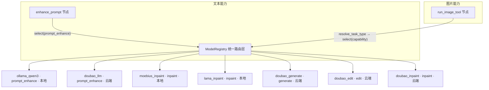
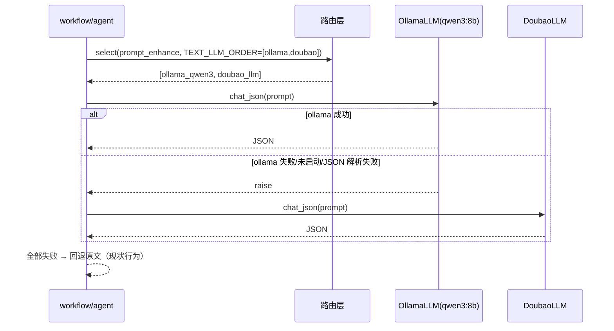
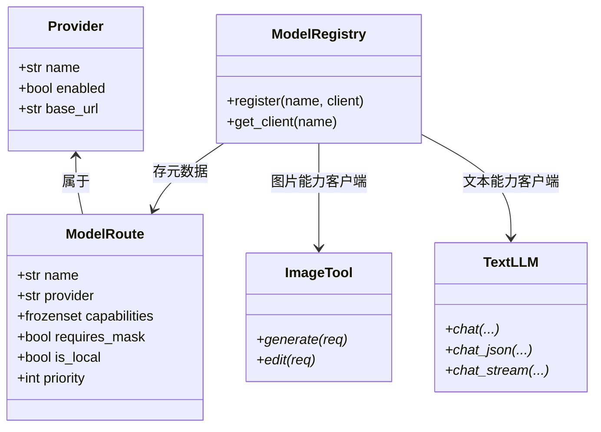

# 模型路由统一 Provider 机制 · 新增 ollama+qwen3 支持

## 1. 设计目的

**设计时点**：分支 `feat/local-model-router`，HEAD `ef64921`（2026-07-07，docs: 语义意图驱动的模型路由设计方案）。本文档基于该版本的代码结构撰写。

**设计类型**：在已有系统中增加功能 + 对路由层做一次抽象收敛（泛化为 provider 机制）。不是全新模块，也不是性能优化。

### 1.1 现有系统状态

当前系统由两层模型调用组成，但只有第一层有"路由"：

- **图片工具层**（`tools/`）：`router.py` 按 `resolve_task_type(has_image, has_mask)` 推断任务类型 `generate / edit / inpaint`，再按 `ToolMeta.priority` 在候选图片工具中选路。已有 5 条路由：`doubao_generate/edit/inpaint`（云端，priority 0）、`moebius_inpaint`（本地，10）、`lama_inpaint`（本地，5）。执行级 fallback 已存在于 `workflow.run_image_tool`（候选全部失败则依次切换）。
- **文本 LLM 层**：`prompt_enhancer.py` 通过模块级单例 `_llm = DoubaoLLM()` **硬编码**调用豆包文本 LLM；`visual_qa` 目前是 stub（直接放行）。这一层没有任何路由。

Provider 的可用性由 `config.enabled_providers()` 决定（doubao 有 `ARK_API_KEY`、moebius 有 `MOEBIUS_ENABLED+weight_dir`、lama 有 `LAMA_ENABLED`）。

### 1.2 用户期望

增加对 `ollama + qwen3:8b` 的支持，且满足两点约束：

1. **统一抽象成 provider 机制**：把"模型路由"从"图片工具路由"泛化为统一的路由框架，图片模型与文本 LLM 统一注册、统一选路，为后续 BYOK 与更多模型铺路。ollama 只是其中一个 provider。
2. **本地/云端优先级由配置开关决定**：文本任务的候选顺序可配置，默认值由设计方建议。

### 1.3 期望与现实之间的冲突（设计前必须指出）

- **qwen3 8B 是纯文本模型**，不能生成或编辑图片。而现有 `router.py` 路由的全是图片工具——**qwen3 无法作为图片工具注册**。这是最大的矛盾点，也是"统一 provider 机制"必须覆盖文本 LLM 层的原因。
- `visual_qa`（视觉质检）是 stub，且视觉质检需要**视觉模型**，qwen3 8B 不具备。故本文档将 `visual_qa` 作为预留能力声明，不接入 qwen3。
- 当前文本路由若优先级配置不当，可能让已配置好 doubao 的存量部署行为变化。设计需保证：**ollama 未启用时，prompt 增强行为与现在完全一致**（仍走 doubao）。

### 1.4 目标定义

达成"统一 provider 机制"需要补充的系统能力：

| 缺失项 | 现状 | 目标 |
|---|---|---|
| 文本能力路由 | `prompt_enhancer` 硬编码 DoubaoLLM | 按能力选路 + 执行级 fallback |
| 统一选路维度 | 仅 `generate/edit/inpaint` | 增加 `prompt_enhance`（预留 `visual_qa`） |
| provider 过滤 | 仅过滤本地工具 | 所有 route 均按 enabled provider 过滤 |
| ollama 接入 | 无 | `OllamaLLM` client + 注册 route + 配置 |

## 2. 设计逻辑

### 2.1 概念空间

统一抽象的核心是引入一组新概念，让"路由"同时覆盖图片与文本：

1. **Provider（模型后端）**：一个具体的外部后端（`doubao / moebius / lama / ollama`），封装连接配置与可用性判定（`enabled_providers()`）。一个 provider 可承载多个 route。
2. **Capability（能力）**：路由选择的任务维度，取代图片专用的"task_type"。枚举：`generate / edit / inpaint / prompt_enhance / visual_qa(预留)`。`resolve_task_type` 仍负责从输入特征推导能力，而文本节点直接以能力名请求路由。
3. **ModelRoute（路由元数据，原 `ToolMeta` 泛化）**：描述"某个 provider 的某模型具备某项能力"，含 `provider / capabilities / priority / is_local / requires_mask`。这是选路的最小决策单元。
4. **TextLLM（文本推理客户端协议）**：`chat / chat_json / chat_stream` 的统一接口，`DoubaoLLM` 与 `OllamaLLM` 都实现它。
5. **ModelRegistry（统一注册表，原 `ImageToolRegistry` 泛化）**：按 route name 存储客户端实例，图片与文本能力共用；图片客户端实现 `ImageTool`，文本客户端实现 `TextLLM`。
6. **invoke_with_fallback（执行级兜底）**：按候选顺序依次调用、失败切换的辅助逻辑，从 `run_image_tool` 中抽出复用。

### 2.2 核心挑战与取舍

**挑战一：统一抽象的统一边界在哪？**

候选方案：
- A. 只统一注册表与选路层，调用层保持 `ImageTool` / `TextLLM` 两套 typed 接口（**选定**）。
- B. 把所有模型调用统一成一个 `invoke(capability, request)` 巨型接口。

取舍：图片工具与文本 LLM 的入参/出参完全不同（图片 bytes/URL vs 文本字符串、异步阻塞 vs 流式）。强行统一（B）会引入大而全的参数对象与类型判断，恰恰增加接入新模型的风险。**统一的关键在选择层，不是调用层**——router 只回答"选谁"，谁负责怎么调由 protocol 各自定义。这也是一种薄封装：暴露两个明确的 typed 协议，而不是把下层能力全包起来。

**挑战二：优先级"由配置开关决定"如何落到现有 priority 机制？**

现状 `select_tool` 只按 `meta.priority` 降序排序，且只对 `is_local` 工具做 enabled 过滤。方案：
- 把 enabled 过滤从"仅本地"泛化为"所有 provider"：`doubao` 无 key 时同样不应成为候选（现状靠 fallback 硬回，语义不干净）。
- 文本路由的优先级由新配置 `TEXT_LLM_ORDER`（逗号分隔的 provider 顺序）**在注册期折算为 priority**（第一个 = 10，其余 = 0），复用现有排序，运行期零额外开销。
- 保留 `_FALLBACK_MAP`：无任何候选时仍回默认 route，保证存量部署行为不变。

取舍：为什么不再引入一个独立的排序字段？因为 `priority` 已贯穿选路与 fallback，复用一个字段改动最小；顺序只在注册期折算一次，不引入第二套排序逻辑。

**挑战三：ollama+qwen3 的可用性与 JSON 可靠性。**

- ollama 默认暴露 OpenAI 兼容接口 `http://localhost:11434/v1`、无 key，`OllamaLLM` 与 `DoubaoLLM` 共用同一 `AsyncOpenAI` 客户端实现，接入成本低。
- qwen3 经 ollama 的 OpenAI 兼容层对 `response_format=json_object` 支持不保证，`chat_json` 需健壮解析（去 markdown 围栏、抽取首个 `{...}`），解析失败即抛错，被 fallback 循环吞掉回退下一候选——与图片工具的 OOM/401 失败走同一条兜底路径。
- 可用性判定沿用现有模式：`OLLAMA_ENABLED=true` 即注册候选，不做运行时探活；ollama 未启动时由执行级 fallback 天然处理（与 moebius/lama 一致）。

### 2.3 统一选路视图



### 2.4 文本能力 fallback 时序（prompt_enhance）



## 3. 核心数据结构

```python
class Capability(str, Enum):
    generate = "generate"
    edit = "edit"
    inpaint = "inpaint"
    prompt_enhance = "prompt_enhance"
    visual_qa = "visual_qa"   # 预留：需视觉模型

@dataclass(frozen=True)
class ModelRoute:            # 原 ToolMeta 泛化
    name: str                # 唯一标识，如 "ollama_qwen3"
    provider: str            # 所属 provider，如 "ollama"
    capabilities: frozenset[Capability]
    requires_mask: bool = False
    is_local: bool = False
    priority: int = 0        # 文本路由由 TEXT_LLM_ORDER 折算
```

```python
class ModelRegistry:         # 原 ImageToolRegistry 泛化
    def register(self, name: str, client: Any) -> None: ...
    def get_client(self, name: str) -> Any: ...
    def has(self, name: str) -> bool: ...

class TextLLM(Protocol):     # 新增
    async def chat(self, system_prompt: str, user_prompt: str, ...) -> str: ...
    async def chat_json(self, system_prompt: str, user_prompt: str, ...) -> dict: ...
    async def chat_stream(self, system_prompt: str, user_prompt: str, ...) -> AsyncIterator[str]: ...
```



## 4. 接口定义

### 4.1 路由层

```python
def resolve_task_type(has_image: bool, has_mask: bool) -> Capability:
    """由输入特征推导图片能力：generate / edit / inpaint。签名不变，返回类型升级为 Capability。"""

def select(
    capability: Capability,
    has_mask: bool = False,
    enabled_providers: set[str] | None = None,
    all_candidates: bool = False,
) -> str | list[str]:
    """按能力选择路由。过滤规则：capability 匹配 + requires_mask 满足 + provider 已启用（不再仅限本地）。
    按 priority 降序；无候选时返回 _FALLBACK_MAP[capability]。"""

def register_route(route: ModelRoute) -> None:
    """注册路由元数据，由各工具模块末尾调用（原 register_tool_meta）。"""

async def invoke_with_fallback(
    capability: Capability,
    invoke,
    enabled_providers: set[str],
    has_mask: bool = False,
) -> Any:
    """执行级兜底：select 全部候选 → 依序调用 invoke(client)，失败切换，全败抛错。"""
```

接口关系总结：节点（`run_image_tool` / `enhance_prompt`）先用 `resolve_task_type` 或直接以能力名构造 `Capability`，调 `select` 得到有序候选，再用 `invoke_with_fallback` 依序执行；调用方无需感知具体 provider。

### 4.2 文本客户端

```python
class OllamaLLM(TextLLM):        # 新增 llm/ollama_client.py
    """ollama OpenAI 兼容客户端。chat_json 做健壮 JSON 解析，ModelCallRecord.provider="ollama"。"""

class DoubaoLLM(TextLLM):        # 现有，实现同一协议即可
    """不变。"""
```

### 4.3 注册的路由表

| route name | provider | capabilities | is_local | priority | 说明 |
|---|---|---|---|---|---|
| `doubao_generate` | doubao | generate | 否 | 0 | 文生图 |
| `doubao_edit` | doubao | edit | 否 | 0 | 图生图 |
| `doubao_inpaint` | doubao | inpaint | 否 | 0 | 云端重绘兜底 |
| `moebius_inpaint` | moebius | inpaint | 是 | 10 | 本地重绘 |
| `lama_inpaint` | lama | inpaint | 是 | 5 | 本地物体移除 |
| `doubao_llm` | doubao | prompt_enhance | 否 | 按 `TEXT_LLM_ORDER` 折算 | 文本增强（新注册） |
| `ollama_qwen3` | ollama | prompt_enhance | 是 | 按 `TEXT_LLM_ORDER` 折算 | 本地文本增强（新增） |

`TEXT_LLM_ORDER` 默认 `ollama,doubao`：折算后 ollama 优先、doubao 兜底；当 `OLLAMA_ENABLED=false` 时 ollama route 被 enabled 过滤，候选只剩 doubao，**存量行为不变**。可改为 `TEXT_LLM_ORDER=doubao,ollama` 令云端优先。

### 4.4 配置（.env.example 新增）

```ini
# ollama 本地模型配置
OLLAMA_ENABLED=false
OLLAMA_BASE_URL=http://localhost:11434/v1
OLLAMA_MODEL=qwen3:8b

# 文本 LLM 候选顺序（逗号分隔，第一个优先；默认 ollama,doubao）
TEXT_LLM_ORDER=ollama,doubao
```

`config.enabled_providers()` 增加：`OLLAMA_ENABLED=true` 时加入 `"ollama"`。

### 4.5 节点改造

- `agents/prompt_enhancer.py`：删除 `_llm = DoubaoLLM()` 单例，改为 `invoke_with_fallback(Capability.prompt_enhance, lambda client: client.chat_json(...), ...)`；全部失败仍回退原文。
- `workflow.run_image_tool`：改调新的 `select`/`invoke_with_fallback`，逻辑不变。
- `workflow.route_after_safety`：判断 `"moebius"/"lama" in enabled` 决定 inpaint 是否走增强——ollama 不参与该判断，逻辑不变。
- `tools/__init__.py`：新增 `doubao_llm`、`ollama_llm` 模块的 import（触发注册）。
- 存量工具文件：`register_tool_meta(ToolMeta(...))` 改 `register_route(ModelRoute(...))`，增补 `provider` 字段。

## 5. 一致性校验

- **概念一致性**：全文统一使用 `Provider / Capability / ModelRoute / TextLLM / ModelRegistry / invoke_with_fallback`，不再混用"task_type / 工具"表述图片与文本。
- **状态完备性**：`select` 无候选 → 回 `_FALLBACK_MAP`（doubao 默认）；`invoke_with_fallback` 全败 → 抛错 → `prompt_enhancer` 捕获回退原文、`run_image_tool` 抛给 workflow 走 fail。两种失败路径均有终态。
- **接口完备性**：`prompt_enhance` 能力有 `doubao_llm` + `ollama_qwen3` 两候选；`generate/edit/inpaint` 候选不变；预留 `visual_qa` 能力不注册路由（无视觉模型，注册会触发 select 报"无候选"——需要时可给 `visual_qa` 单独兜底，本次不展开）。
- **层次一致性**：路由层只选路不执行；节点只执行不问 provider 来源；`OllamaLLM` 只做协议调用不做路由决策。
- **可靠性**：ollama 未启动/超时/JSON 解析失败均被 fallback 吞掉，不回显给用户；`ModelCallRecord` 记录 `provider="ollama"`，便于排查。
- **安全性**：ollama 默认本地回环地址，无密钥；若配成远程地址则无鉴权——设计文档注明仅限开发/内网使用，与 BYOK 文档（密钥不进浏览器）不冲突。
- **可测试性**：`select` 为纯函数（输入 capability + enabled set），可单测覆盖顺序折算与 enabled 过滤；`OllamaLLM` 可用 mock `AsyncOpenAI` 测试。

## 6. 变更历史

| 日期 | 变更内容 | 原因 |
|---|---|---|
| 2026-08-04 | 初稿：统一 provider 机制设计，新增 ollama+qwen3 文本能力支持 | 需求：接入 ollama+qwen3 8B，统一模型路由抽象 |
