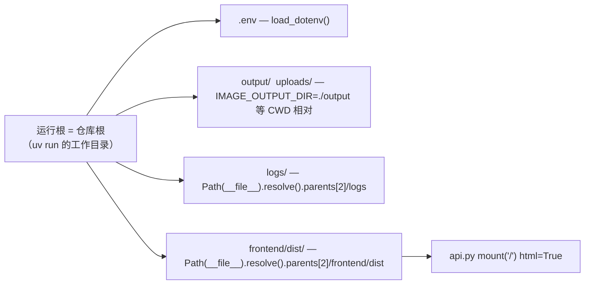

# painterAgent src/ 布局 + uv 迁移 设计文档

## 1. 设计目的

### 1.1 项目现状（设计基线）

- **项目状态**：分支 `feat/local-model-router`，HEAD commit `85a582a`，设计时间 2026-08-05。
- **技术栈**：Python 3.11（pyenv 虚拟环境 `image-editor`，`.python-version` = `3.11.9`）+ FastAPI + LangGraph + Dramatiq；前端 React/Vite。

当前目录（重构前）：

```text
drawAgent/
├── pyproject.toml            # name="image-editor"；packages.find where=[".."]（非常规写法）
├── image_editor/             # Python 包，直接躺在仓库根（非 src/ 布局）
│   ├── __init__.py  main.py  api.py  config.py  models.py
│   ├── state.py  storage.py  workflow.py  worker.py  tasks.py  errors.py
│   ├── agents/  llm/  tools/
│   ├── frontend/             # React 前端被塞在 Python 包内部
│   ├── docs/                 # 历史设计文档
│   ├── README.md  TODOs.md  schema.sql
│   ├── output/  uploads/     # 运行时残留（真实数据在仓库根同名目录）
├── image_editor.egg-info/    # 旧 editable 安装残留
├── .python-version  .env  .env.example  start-dev.sh  AGENTS.md  DEPLOY.md
├── output/  uploads/  logs/  # 运行时产物（CWD 相对）
└── *.md                      # 两份长期规划文档
```

### 1.2 现状的问题（本设计要消除的）

1. **布局非常规**：包位于仓库根而非 `src/`，且 `packages.find where=[".."]` 是"从项目根之外找包"的反直觉写法，依赖旧 editable 安装才能运行。
2. **前端混入 Python 包**：`api.py` 用 `Path(__file__).parent / "frontend" / "dist"` 就近挂载，把"前端是独立工程"这一事实编码进了包内部，包内路径随移动即失效。
3. **pyenv / uv 并存**：`start-dev.sh` 硬编码 pyenv 虚拟环境路径，README 同时维护两套命令。
4. **运行时目录双份残留**：`image_editor/output/`、`image_editor/uploads/` 与仓库根同名目录并存，真实数据在根目录，包内是历史遗留。
5. **命名不一致**：仓库名 `painterAgent`、Docker 镜像名 `painteragent`、Python 包名 `image_editor`、前端工程名 `image-editor-frontend`，四套命名各自为政。

### 1.3 设计目标

把项目重构为常规 `src/` 布局，并统一由 `uv` 管理：

- 包迁移到 `src/<包名>/`；前端迁出到仓库根 `frontend/`；pyproject 包发现改为 `where=["src"]`。
- **包名统一为 `painterAgent`**（与仓库/Docker 名一致，见 2.1 决策）。
- 移除全部 pyenv 相关配置与脚本逻辑，所有入口走 `uv run`。
- 运行时路径统一**锚定仓库根（运行根）**，消除 `__file__` 就近定位造成的路径漂移。
- 清理 `*.egg-info` 与包内运行时残留。
- 文档（AGENTS.md / README.md / .gitignore / start-dev.sh）同步适配。

## 2. 设计逻辑

本次是**对已有实现的重构**（工程化改造），不新增业务功能。围绕 3 个核心挑战建立方案：

### 2.1 挑战一：包名与顶层布局 —— 为什么 `src/` + 改名 `painterAgent`

**为什么用 `src/` 布局**：uv/hatchling 等项目工具链的默认推荐布局。它把"源码"与"仓库根的其他内容（前端、文档、运行时目录、脚本）"分隔开，使 `output/`、`frontend/` 等不会再出现在包目录里，也避免源码目录被构建产物污染。无替代取舍——`src/` 是常规做法，直接采用。

**为什么改名 `painterAgent`**：当前包名 `image_editor` 与仓库名、Docker 镜像名三者不一致。包名只作为导入路径与 dramatiq 模块名使用，改名的成本是一次机械的 import 重写（本设计已承担全部重写），趁本次大重构一并统一，避免将来再改造成本更高。

| 方案 | 优点 | 缺点 | 结论 |
|---|---|---|---|
| 保留 `image_editor` | 改动最小 | 命名继续三套分裂 | 否 |
| 改名 `painterAgent` | 与仓库/Docker 一致，语义即"绘图 Agent" | 需重写所有 import | **是** |

### 2.2 挑战二：前端外移后，静态资源如何被后端找到 —— 仓库根锚定

前端移出包后，`api.py` 不能再依赖 `Path(__file__).parent / "frontend" / "dist"`（`__file__` 现在位于 `src/painterAgent/` 下，路径会指向 `src/painterAgent/frontend`）。

**方案**：把运行时资源路径的解析统一为**仓库根锚定**——通过 `Path(__file__).resolve().parents[2]` 从包内文件回溯到仓库根，再拼接 `frontend/dist`、`logs` 等。src/ 布局恰好让包固定在 `parents[2]` 这一层（`src/painterAgent/api.py` → `api.py` 的 parents: `[painterAgent, src, 仓库根]`）。

**为什么可行**：本项目始终以"仓库根为 CWD"运行（`uv run` 在仓库根执行、Docker 部署 `WORKDIR /app` 并 `uv run`），因此"仓库根 = 运行根 = CWD"三者恒等。若未来以 wheel 方式装进 site-packages 运行，该回溯会失效——但本项目不是库，没有这种部署形态，不做额外处理（保持简单）。



### 2.3 挑战三：构建与包管理切换（pyenv → uv）

- `pyproject.toml` 补上 `[build-system]`（当前缺失），包发现改为 `where=["src"]`、`include=["painterAgent*"]`。
- `.python-version`（`3.11.9`）**保留在仓库根**：uv 用它解析项目 Python 版本；同时删除 `.venv/` 之外所有 pyenv 痕迹。
- `start-dev.sh` 去掉 pyenv 解析逻辑，改为 `uv run python -m ...`；删除其中 `cd "$ROOT/image_editor"` 等旧路径。
- 运行时目录 `output/`、`uploads/` 收敛到仓库根（删除 `image_editor/output`、`image_editor/uploads` 残留）。

### 2.4 实施路径

1. `git mv image_editor src/painterAgent`（保留 git 历史）。
2. `git mv src/painterAgent/frontend frontend`；`git mv src/painterAgent/docs docs`。
3. `git mv src/painterAgent/README.md README.md`、`schema.sql`、`TODOs.md` 移入仓库根。
4. 重写包内全部 `image_editor` → `painterAgent` import；更新 `main.py` 的 uvicorn 字符串与日志路径、`api.py` 前端挂载路径、`worker.py` 的 `sys.argv`。
5. 更新 `pyproject.toml`（name/build-system/packages.find）、`.gitignore`（`image_editor/frontend/*` → `frontend/*`）、`start-dev.sh`、`AGENTS.md`、`README.md`。
6. 删除 `image_editor.egg-info/` 与包内 `__pycache__/`、`output/`、`uploads/` 残留。
7. 运行 `uv sync` 生成 `uv.lock` + `.venv`，`uv run python -m painterAgent.main` / `uv run python -m dramatiq painterAgent.worker --processes 1 --threads 2` 验证。（本次仅完成 1–6，`uv sync` 由用户后续执行。）

### 2.5 概念空间

- **运行根（run root）**：项目启动时的工作目录，恒等于仓库根。所有运行时产物（`output/`、`uploads/`、`logs/`）、`.env` 均相对运行根解析。该概念统一了此前混用的"包内相对路径"与"CWD 相对路径"两套规则。
- **仓库根锚定（repo-root anchoring）**：包内代码通过 `Path(__file__).resolve().parents[2]` 从 `src/painterAgent/` 回溯到运行根，再拼接前端 dist、logs 等路径。该概念封装了"src/ 布局使包深了一层"这一复杂性，使路径解析与包所在位置解耦。

## 3. 核心数据结构

### 3.1 目标目录树（重构后的仓库结构）

```text
painterAgent/                     # = 运行根
├── pyproject.toml                # name="painterAgent"；where=["src"]
├── uv.lock                       # uv sync 生成（设计契约，本次不生成）
├── .python-version               # 3.11.9 — uv 解析 Python 版本
├── .env  .env.example
├── .gitignore
├── AGENTS.md  README.md  schema.sql  TODOs.md  start-dev.sh
├── src/
│   └── painterAgent/             # 原 image_editor/（git mv，保留历史）
│       ├── __init__.py  main.py  api.py  config.py  models.py
│       ├── state.py  storage.py  workflow.py  worker.py  tasks.py  errors.py
│       ├── agents/  llm/  tools/
├── frontend/                     # 原 image_editor/frontend/
│   ├── index.html  package.json  vite.config.ts  src/
│   └── dist/                     # 构建产物（gitignore）
├── docs/                         # 原 image_editor/docs/ + 本设计文档
├── output/  uploads/  logs/      # 运行时产物（gitignore）
└── LLM-VLM-JEPA-Interview-Roadmap.md  Multi-Turn-Image-Editing-Long-Term-Implementation.md
```

### 3.2 运行时路径解析表

| 资源 | 当前解析方式 | 重构后解析方式 | 锚定概念 |
|---|---|---|---|
| `.env` | `load_dotenv()`（CWD 相对） | 不变（CWD=运行根） | 运行根 |
| `output/` | `./output`（CWD 相对） | 不变 | 运行根 |
| `uploads/` | `./uploads`（CWD 相对） | 不变 | 运行根 |
| `logs/` | `Path(__file__).parent.parent/"logs"` | `Path(__file__).resolve().parents[2]/"logs"` | 仓库根锚定 |
| `frontend/dist/` | `Path(__file__).parent/"frontend"/"dist"` | `Path(__file__).resolve().parents[2]/"frontend"/"dist"` | 仓库根锚定 |

## 4. 接口定义

重构不改变对外接口（API 路由、环境变量、静态路由路径均不变），改变的只是**启动方式与文件位置契约**。

### 4.1 启动命令

```bash
# 后端（原：python -m image_editor.main / pyenv）
uv run python -m painterAgent.main                   # localhost:8000

# Worker（原：python -m dramatiq image_editor.worker）
uv run python -m dramatiq painterAgent.worker --processes 1 --threads 2

# 前端（原：cd image_editor/frontend && npm run dev）
cd frontend && npm run dev                           # localhost:5173

# 一键启动（start-dev.sh，内部已改为 uv run，用法不变）
./start-dev.sh
```

### 4.2 保持不变的对外接口

- API 路由：`/projects`、`/sessions`、`/turns`、`/jobs`、`/upload`、`/output`、`/uploads`、`/`（前端）。
- 环境变量：`ARK_API_KEY`、`ARK_BASE_URL`、`DOUBAO_MODEL`、`IMAGE_OUTPUT_DIR`、`IMAGE_UPLOAD_DIR`、`MOEBIUS_*`、`LAMA_*`、`DATABASE_URL`、`REDIS_URL`、`DEBUG`。
- 数据库 DDL：`schema.sql`（移入仓库根，初始化命令不变）。

### 4.3 构建配置接口（pyproject.toml）

```toml
[project]
name = "painterAgent"
version = "0.1.0"
requires-python = ">=3.11"
# ...dependencies / optional-dependencies 原样保留

[build-system]
requires = ["setuptools>=68"]
build-backend = "setuptools.build_meta"

[tool.setuptools.packages.find]
where = ["src"]
include = ["painterAgent*"]
```

### 4.4 文件位置契约（迁移后约定）

| 文件/目录 | 新位置 | 原因 |
|---|---|---|
| Python 包 | `src/painterAgent/` | src/ 布局 |
| 前端工程 | `frontend/` | 独立于包的独立工程 |
| 设计文档 | `docs/` | 仓库级文档不进包 |
| `README.md`/`schema.sql`/`TODOs.md` | 仓库根 | 项目级文档/DDL 与包代码解耦 |
| `.python-version` | 仓库根 | uv 解析 Python 版本 |

## 5. 一致性校验

- **概念一致性**：全文统一用"运行根"与"仓库根锚定"两个概念描述路径解析；包名统一为 `painterAgent`，不存在 `image_editor` 与 `painterAgent` 混用。
- **接口完备性**：3.2 路径解析表覆盖了所有被 `__file__`/CWD 影响的资源（logs、frontend/dist、output、uploads、.env）；4.1 覆盖全部三个进程入口（后端、worker、前端）+ 一键脚本。
- **层次一致性**：前端 dist 的挂载路径属于后端 API 层职责，保留在 `api.py`；包发现、build-system 属构建层，保留在 `pyproject.toml`；Python 版本解析移交给 uv（`.python-version`），不再由脚本硬编码。
- **状态/异常情形**：
  - 历史设计文档（`docs/`、根目录两份规划 md）引用旧路径 `image_editor/...` —— 它们是针对基线 commit 的历史记录，**保留原文不改写**，靠 1.1 的基线声明防止误导。
  - `frontend/dist/` 在未构建时不存在的场景：`api.py` 现有的 `if _frontend_dir.exists()` 守卫保留，缺省时 API 照常工作，仅静态页缺失。
  - 以 wheel 安装到 site-packages 运行会使仓库根锚定失效 —— 本项目无此部署形态，明确不处理（2.2 已说明）。
- **安全/可维护性**：`.env` 不进 git 不变；`git mv` 保历史，便于 review；`.gitignore` 中 `image_editor/frontend/*` 改为 `frontend/*`，`output/`、`uploads/`、`logs/` 保持忽略。

## 6. 变更历史

| 日期 | 变更内容 | 原因 |
|---|---|---|
| 2026-08-05 | 初版：src/ 布局 + 包名 drawagent + 前端外移 + uv 迁移设计 | 发起工程化重构 |
| 2026-08-05 | 按设计实施：git mv 目录、重写 imports、pyproject/.gitignore/脚本/文档适配、清理残留 | 重构落地（uv sync 留待用户执行） |
| 2026-08-06 | 全文 drawagent → painterAgent（包名/仓库/Docker 三处命名统一为 painterAgent） | 文档滞后于实现，补齐命名一致性 |
