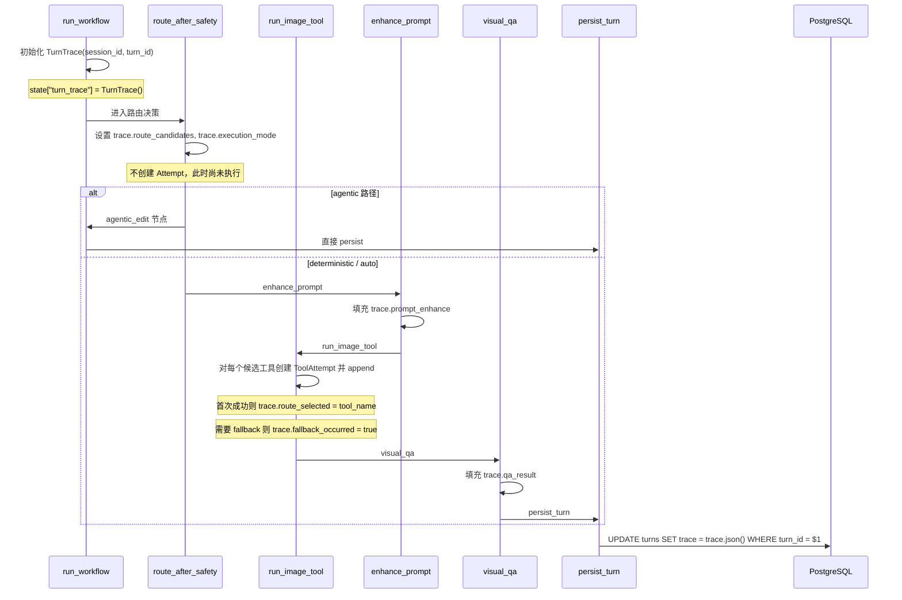
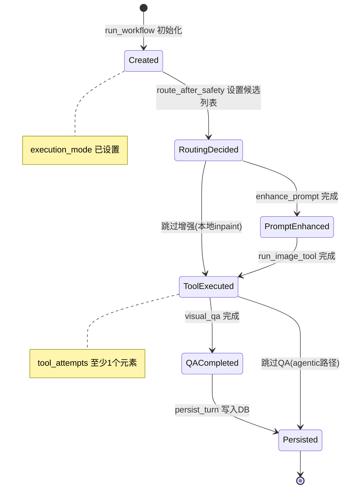
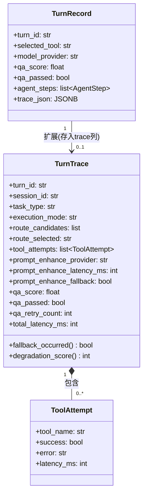

# Trace（决策迹）功能设计文档

## 1. 设计目的

### 1.1 定性

本设计为 **在已有系统中增加功能**——在 painterAgent 的多轮修图工作流中引入结构化决策追踪（trace）能力，使每一次 turn 执行过程中的关键决策点（路由选择、fallback 链路、QA 判定）可查询、可聚合、可审计。

### 1.2 项目基线

| 属性 | 值 |
|------|-----|
| 分支 | `feat/local-model-router` |
| 修订 | `a662bf5b2a40ff63e13ef2728340aa4802a9a199` |
| 设计时间 | 2026-08-09 |

### 1.3 现状建模

当前系统的可观测性完全依赖 Python `logging` 模块：

```
┌──────────┐    log.info()     ┌──────────────┐
│ workflow │ ────────────────▶ │ 日志文件      │
│ 节点     │    log.warning()  │ (滚动删除)    │
└──────────┘                   └──────────────┘
```

日志回答了「发生了什么」——哪个工具被调用、是否有 fallback、耗时多少——但存在三个结构性缺陷：

1. **不可查询**：无法用 SQL 回答"过去一周 moebius 的 fallback 率是多少？"
2. **不可关联**：一条 turn 的日志分散在多个节点、多个时间点，无法作为整体获取
3. **不可暴露**：日志是内部实现细节，无法安全地展示给前端用户

### 1.4 目标

引入结构化 trace 后，系统在日志之外增加一条结构化通路：

```
┌──────────┐   log.info()    ┌──────────────┐
│ workflow │ ───────────────▶│ 日志文件      │
│ 节点     │                 └──────────────┘
│          │   trace.record()  ┌──────────────┐
│          │ ────────────────▶ │ turns.trace  │ ─── GET /turns/{id} ─── ▶ 前端
└──────────┘                   │ (JSONB列)    │
                               └──────────────┘
```

具体目标：

- **T1 — 可查询**：支持按 `fallback_occurred`、`provider`、`task_type` 等维度过滤和聚合
- **T2 — 可关联**：一个 turn 的全部决策信息作为整体获取（通过 `GET /turns/{id}` 返回）
- **T3 — 可暴露**：前端能展示决策链路（路由选择、fallback 原因），帮助用户理解系统行为
- **T4 — 最小侵入**：不改动现有 workflow 拓扑，不强制所有节点参与 trace

---

## 2. 设计逻辑

### 2.1 核心挑战与方案选择

#### 挑战 1：trace 的粒度应该多大？

日志可以随意在任何位置插入，但 trace 需要设计「决策点」——哪些节点输出应该被结构化记录。

**选择**：聚焦三个核心决策点，不试图覆盖所有节点。

| 决策点 | 所在节点 | 记录内容 |
|--------|---------|---------|
| 路由选择 | `route_after_safety` + `run_image_tool` | 候选工具列表、优先级、最终选择、每次尝试结果 |
| Prompt 增强 | `enhance_prompt` | 使用的 LLM provider、是否 fallback |
| QA 判定 | `visual_qa` | 评分、是否通过、重试建议 |

备选方案（已拒绝）：
- 全量 trace：记录每个节点的输入/输出。**拒绝原因**——LangGraph 本身已提供 state 快照，重复建设且存储成本高。
- 仅 trace 失败路径：**拒绝原因**——失败路径的统计分母需要成功路径数据。

#### 挑战 2：trace 如何与 LangGraph 的 `astream` 模式共存？

当前 `run_workflow` 通过 `graph.astream(initial)` 逐个节点消费事件，节点返回的 dict 被合并到 state 中。trace 对象如果作为 state 字段传递，会在每个节点之间被序列化/反序列化。

**选择**：trace 对象作为 state 中的一个字段 `turn_trace`，各节点通过 `state.get("turn_trace")` 读写。`persist_turn` 节点负责将 trace 序列化落库。

备选方案（已拒绝）：
- trace 作为全局单例：**拒绝原因**——多 worker 线程并发时 trace 会交叉污染。
- trace 通过 LangGraph config 的 `configurable` 传递：**拒绝原因**——LangGraph 的 `configurable` 只读，节点不能写回。

#### 挑战 3：存储方案——独立表还是 JSONB 列？

**选择**：采用两阶段策略。

- **阶段一（本设计）**：在 `turns` 表新增 `trace JSONB DEFAULT '{}'` 列。开发成本最低，立即可用，不阻塞已有查询。
- **阶段二（后续演进）**：当聚合查询需求增长（如跨 session 的 provider 性能对比）时，从 JSONB 中提取热点字段建立独立表 `turn_traces` 或物化视图。

备选方案（已拒绝）：
- 一步到位建独立表：**拒绝原因**——当前 trace 字段集合尚不稳定，过早固化 schema 会导致频繁 migration。

### 2.2 概念空间

本设计引入以下新概念：

#### 决策迹（TurnTrace）

> **定义**：一个 turn 执行过程中所有关键决策的结构化记录。由 workflow 各节点逐步填充，最终随 turn 一同持久化。

**构成**：由 `route_decision`（路由决策）、`tool_attempts`（工具尝试序列）、`prompt_enhance_result`（增强结果）、`qa_result`（QA 结果）组成。这些子概念本身也源自已有概念（`task_type`、`tool_name`、`qa_score`），但 TurnTrace 为它们建立了统一的容器和生命周期。

**封装**：TurnTrace 封装了「一次执行走了什么路径、为什么」这个语义——调用方不需要读分散的日志行来拼接全貌。

#### 降级分（DegradationScore）

> **定义**：一个 0-N 的整数，量化本次执行偏离最优路径的程度。0 表示无降级（首选工具一次成功），值越高表示越多 fallback/重试。

**计算规则**：每次 fallback +1，每次 QA 重试 +1，QA 不通过额外 +2。这是一个派生指标，不直接存储而是从 `tool_attempts` 和 `qa_result` 计算得出。

**用途**：运维人员可以通过 `degradation_score > 0` 快速过滤出「不够顺利」的执行，前端可以在 turn 详情中展示降级警告。

#### 工具尝试（ToolAttempt）

> **定义**：路由选择后，对候选列表中某一个工具的单次调用尝试。包含工具名、成功/失败、错误原因、耗时。

**与已有 `AgentStep` 的关系**：`AgentStep` 是 agentic 模式中规划模型发起的工具调用（语义层），`ToolAttempt` 是路由层对底层工具的实际调用（执行层）。两者不同层，不合并。

### 2.3 数据流



### 2.4 状态变迁

`TurnTrace` 从创建到持久化的生命周期：



### 2.5 与现有模块的关系

| 现有模块 | 交互方式 |
|---------|---------|
| `state.py` / `ImageEditState` | 新增 `turn_trace` 可选字段 |
| `workflow.py` 各节点 | 各节点读取/写入 trace 的对应子字段 |
| `storage.py` / `PostgresStore` | `update_turn` 自动处理 `trace` 字段 JSON 序列化 |
| `models.py` / `TurnDetailResponse` | 新增 `trace` 字段，前端可直接消费 |
| `api.py` | 无需改动，`get_turn` 返回的 `TurnDetailResponse` 已包含 trace |

封装策略：**薄封装**。trace 通过已有的 `TurnDetailResponse` 直接暴露给前端，不做额外转换。各 workflow 节点通过 state 字典读写 trace，不引入新的抽象层。

---

## 3. 核心数据结构

### 3.1 `TurnTrace`

```python
@dataclass
class TurnTrace:
    """一个 turn 的完整决策轨迹 — 决策迹"""
    turn_id: str
    session_id: str

    # 路由决策
    task_type: str | None = None           # generate / edit / inpaint
    execution_mode: str | None = None      # auto / agentic / deterministic
    route_candidates: list[str] = field(default_factory=list)
    route_selected: str | None = None      # 最终选中的工具名

    # 工具执行
    tool_attempts: list[ToolAttempt] = field(default_factory=list)

    # Prompt 增强
    prompt_enhance_provider: str | None = None
    prompt_enhance_latency_ms: int = 0
    prompt_enhance_fallback: bool = False   # 增强是否也走了 fallback

    # QA
    qa_score: float | None = None
    qa_passed: bool | None = None
    qa_retry_count: int = 0

    # 耗时
    total_latency_ms: int = 0

    @property
    def fallback_occurred(self) -> bool:
        """是否有工具尝试失败导致 fallback"""
        return len(self.tool_attempts) > 1 and any(
            not a.success for a in self.tool_attempts[:-1]
        )

    @property
    def degradation_score(self) -> int:
        """降级分：0=完美路径，越高越差"""
        score = 0
        if self.fallback_occurred:
            score += 1
        score += sum(1 for a in self.tool_attempts if not a.success)
        if self.qa_retry_count > 0:
            score += self.qa_retry_count
        if self.qa_passed is False:
            score += 2
        return score
```

### 3.2 `ToolAttempt`

```python
@dataclass
class ToolAttempt:
    """单次工具调用尝试"""
    tool_name: str            # 如 "moebius_inpaint"
    success: bool
    error: str | None = None
    latency_ms: int = 0
```

### 3.3 数据关系



### 3.4 数据库变更

`turns` 表新增一列：

```sql
ALTER TABLE turns ADD COLUMN trace JSONB DEFAULT '{}';
```

内存存储（`MemoryStore`）的 `_turns` dict 中 `TurnRecord` 已通过 Pydantic model 支持扩展字段（`update_turn` 使用 `setattr`），无需 schema 变更。

---

## 4. 接口定义

### 4.1 存储层（`storage.py`）

`update_turn` 方法已有通用 `**fields` 机制，`trace` 作为 JSONB 字段自动适配。无需新增方法。

### 4.2 工作流节点

各节点通过 state dict 读写 trace，函数签名不变。

```python
# workflow.py: run_image_tool 节点内部（伪代码）

async def run_image_tool(state: ImageEditState) -> dict:
    trace = state.get("turn_trace")
    if trace is None:
        trace = TurnTrace(
            turn_id=state["turn_id"],
            session_id=state["session_id"],
            task_type=task_type,
            execution_mode=state.get("execution_mode"),
            route_candidates=tool_names,
        )

    for tool_name in tool_names:
        attempt = ToolAttempt(tool_name=tool_name, success=False)
        t0 = time.time()
        try:
            result = await tool.generate(req)  # 或 tool.edit(req)
            attempt.success = True
            attempt.latency_ms = int((time.time() - t0) * 1000)
            trace.tool_attempts.append(attempt)
            trace.route_selected = tool_name
            break
        except Exception as e:
            attempt.error = str(e)[:200]
            attempt.latency_ms = int((time.time() - t0) * 1000)
            trace.tool_attempts.append(attempt)

    return {
        "output_image_id": result.image_id,
        "turn_trace": trace,
        ...
    }
```

**总结**：`run_image_tool` 在遍历候选工具时构建 `ToolAttempt` 序列，成功则记录最终选择，失败则记录错误原因。trace 作为返回 dict 的一部分合并到 state，供下游节点继续填充。

### 4.3 API 层（`api.py`）

无需新增接口。`GET /turns/{id}` 返回的 `TurnDetailResponse` 包含 trace 字段，前端可直接获取。

trace 通过 `TurnDetailResponse` 的 JSON 序列化传递到前端，格式如下：

```json
{
  "turn_id": "turn_abc123",
  "trace": {
    "task_type": "inpaint",
    "execution_mode": "auto",
    "route_candidates": ["moebius_inpaint", "doubao_inpaint"],
    "route_selected": "doubao_inpaint",
    "tool_attempts": [
      {"tool_name": "moebius_inpaint", "success": false, "error": "CUDA OOM", "latency_ms": 3400},
      {"tool_name": "doubao_inpaint", "success": true, "error": null, "latency_ms": 8500}
    ],
    "fallback_occurred": true,
    "degradation_score": 1,
    "prompt_enhance_provider": null,
    "prompt_enhance_latency_ms": 0,
    "prompt_enhance_fallback": false,
    "qa_score": 0.95,
    "qa_passed": true,
    "qa_retry_count": 0,
    "total_latency_ms": 11900
  }
}
```

**总结**：前端通过已有的 `GET /turns/{id}` 获取 trace，展示路由选择链路（绿色=首选成功，橙色=fallback 后成功，红色=全部失败）。运维可通过 `degradation_score` 字段快速定位问题 turn。

### 4.4 内部接口：Trace 序列化协议

trace 对象在 state dict 中传递时是 Python 对象，在 JSONB 列中存储时是 dict。序列化由 `TurnTrace` 的 `to_dict()` / `from_dict()` 处理：

```python
# trace.py

def trace_to_dict(trace: TurnTrace) -> dict:
    """将 TurnTrace 序列化为 JSONB 兼容的 dict"""
    return {
        "task_type": trace.task_type,
        "execution_mode": trace.execution_mode,
        "route_candidates": trace.route_candidates,
        "route_selected": trace.route_selected,
        "tool_attempts": [
            {"tool_name": a.tool_name, "success": a.success,
             "error": a.error, "latency_ms": a.latency_ms}
            for a in trace.tool_attempts
        ],
        "prompt_enhance_provider": trace.prompt_enhance_provider,
        "prompt_enhance_latency_ms": trace.prompt_enhance_latency_ms,
        "prompt_enhance_fallback": trace.prompt_enhance_fallback,
        "qa_score": trace.qa_score,
        "qa_passed": trace.qa_passed,
        "qa_retry_count": trace.qa_retry_count,
        "total_latency_ms": trace.total_latency_ms,
    }

def trace_from_dict(d: dict, turn_id: str, session_id: str) -> TurnTrace:
    """从 JSONB dict 反序列化 TurnTrace"""
    trace = TurnTrace(turn_id=turn_id, session_id=session_id, **{
        k: v for k, v in d.items()
        if k not in ("tool_attempts",)
    })
    for a in d.get("tool_attempts", []):
        trace.tool_attempts.append(ToolAttempt(**a))
    return trace
```

### 4.5 前端展示（`TurnTimeline` / Turn 详情面板）

trace 在前端的展示建议（本次设计不做详细 UI 设计）：

- **路由链路**：横向排列候选工具，选中者高亮，失败者灰色 + 错误 tooltip
- **降级警告**：`degradation_score > 0` 时在 turn 卡片右上角显示橙色三角形
- **耗时分解**：hover 时展开各阶段耗时（prompt 增强 / 工具调用 / QA）

---

## 5. 一致性校验

### 5.1 概念一致性

| 概念 | 全文使用 |
|------|---------|
| TurnTrace（决策迹） | 统一使用，不在其他地方称为 execution_record 或 decision_log |
| ToolAttempt（工具尝试） | 统一使用，不与 AgentStep（代理步迹）混用 |
| DegradationScore（降级分） | 统一使用，不在其他地方称为 quality_score 或 health_score |

### 5.2 状态完备性

TurnTrace 生命周期状态机覆盖所有路径：

- `Created → RoutingDecided → PromptEnhanced → ToolExecuted → QACompleted → Persisted`（agentic 路径：`Created → RoutingDecided → Persisted`）
- `ToolExecuted` 状态时 `tool_attempts` 至少包含 1 个元素（全失败则最后一个是失败记录）
- `Persisted` 是终态，不可变

异常处理：
- **workflow 中途崩溃（如 OOM）**：trace 未被持久化，`turns` 表的 `trace` 列保持默认 `{}`。前端展示时判空，不显示决策链路面板。
- **所有工具均失败**：`tool_attempts` 包含全部失败记录，`route_selected` 为 None，`degradation_score` 为 N+1（N=候选数）。
- **replay 场景**：每次 replay 创建新 turn，trace 独立记录，不继承。
- **cancel 场景**：job 被取消时 `persist_turn` 不执行，trace 不落库，与崩溃场景一致。

### 5.3 接口完备性

| 设计逻辑中提到的操作 | 对应接口 |
|-------------------|---------|
| 初始化 trace | `run_workflow` 中创建 `TurnTrace` 对象 |
| 填充路由决策 | `route_after_safety` 中设置 `route_candidates`、`execution_mode` |
| 记录工具尝试 | `run_image_tool` 中 `trace.tool_attempts.append(attempt)` |
| 记录 prompt 增强 | `enhance_prompt` 中设置 `prompt_enhance_provider` 等字段 |
| 序列化落库 | `persist_turn` 中 `store.update_turn(turn_id, trace=trace_to_dict(trace))` |
| 反序列化读取 | `_to_turn_detail` 中 `trace_from_dict(turn.get("trace", {}))` |
| 前端展示 | `TurnDetailResponse.trace` 字段通过 `GET /turns/{id}` 返回 |

### 5.4 层次一致性

- trace 的写入职责完全在 workflow 节点层，存储层只负责序列化/反序列化——不越界
- trace 的读取职责在前端和运维查询层，workflow 节点不依赖之前 turn 的 trace——不形成循环依赖
- `turn_trace` 字段仅在 workflow 内部流转，不暴露给外部 API 调用方作为输入——不污染 API 契约

### 5.5 存储一致性

- `MemoryStore.update_turn` 通过 `setattr(turn, k, v)` 自动支持 trace 字段
- `PostgresStore.update_turn` 通过 `TurnRecord.model_fields` 白名单 + JSON 序列化自动支持 trace 字段
- 两种存储后端行为一致，无需分别实现

---

## 6. 变更历史

| 日期 | 变更内容 | 原因 |
|------|---------|------|
| 2026-08-09 | 初始版本 | 引入 trace 决策迹功能设计 |
