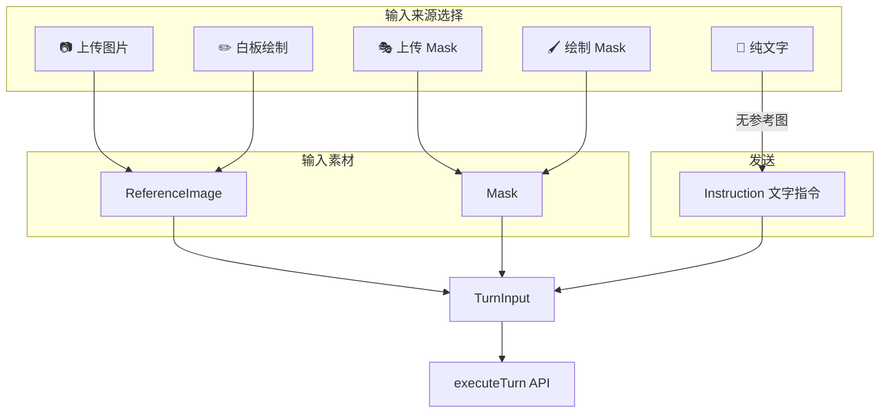
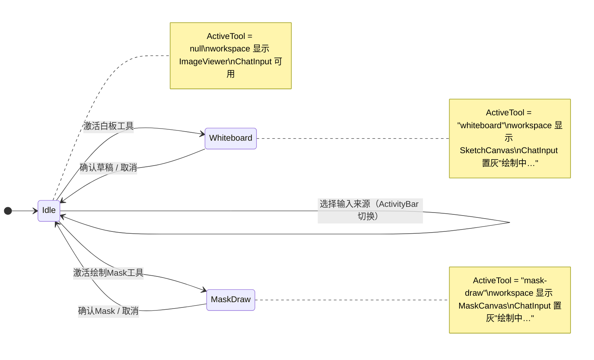
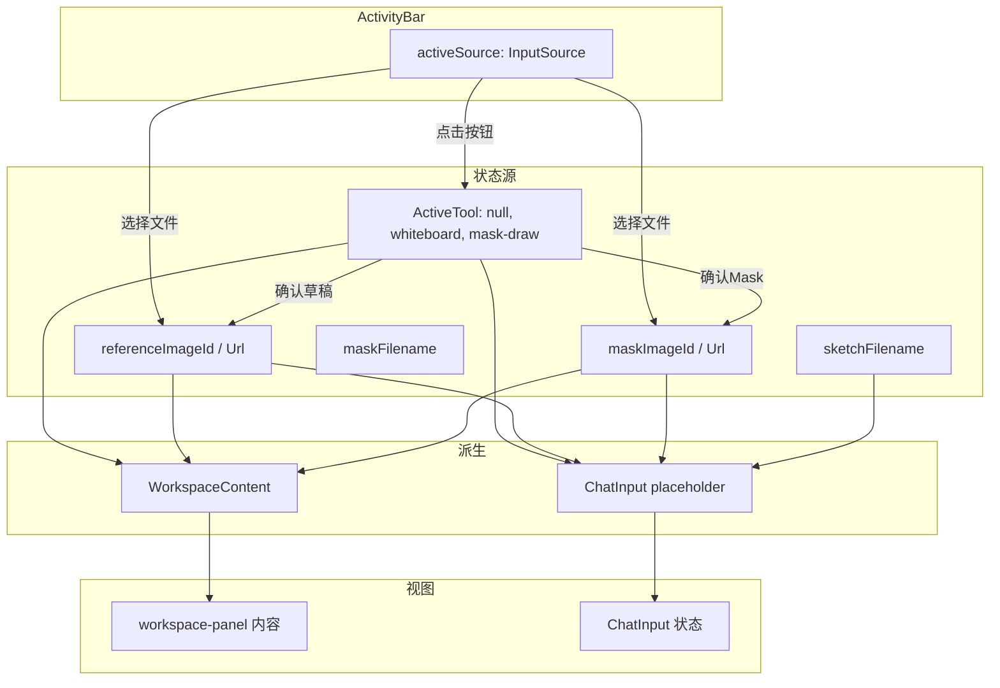

# 以对话为中心的 UI 重构设计文档

## 1. 设计目的

### 1.1 定性

这是一次**交互模型重构**——将前端从「以工具为中心」的布局改造为「以对话为中心」的布局。涉及前端组件的拆分、重组和交互逻辑变更，不涉及后端 API 改动。

### 1.2 现状建模

经过第一阶段的布局重构（见 `frontend-workspace-layout-design.md`，已实现），当前界面结构如下：

```
┌── header ──────────────────────────────────────────────────┐
│ Painter Agent                       [?] [⤢] [◑]           │
├── body ────────────────────────────────────────────────────┤
│ ┌── split-pane ────────────────────────┬─ timeline ───────┤
│ │ chat-panel (40%, 可拖拽) │ workspace-panel (60%)        │
│ │ ┌─────────────────────┐  │ ┌─────────────────────────┐ │
│ │ │ 对话记录 (ChatHistory)│  │ │ ImageViewer (单图聚焦)   │ │
│ │ │                     │  │ │ + 角落参考缩略图          │ │
│ │ │ 用户气泡 / AI气泡    │  │ └─────────────────────────┘ │
│ │ │                     │  │ ┌─────────────────────────┐ │
│ │ └─────────────────────┘  │ │ InstructionInput        │ │
│ │                          │ │ [选图][白板][Mask]… [发送]│ │
│ └──────────────────────────┴─┴─────────────────────────┘ │
└──────────────────────────────────────────────────────────┘
```

关键事实：

- **ChatHistory** 已存在，展示对话气泡式交互历史，支持选中/重试/删除
- **ImageViewer** 已改为单图聚焦视图，输入图以角落浮层参考卡展示
- **InstructionInput** 仍然是一个**单体组件**：工具按钮（选择图片/白板/上传 Mask/绘制 Mask）+ 文本输入 + 发送按钮全部集中在一个水平条中，位于 workspace-panel 底部
- 白板和 Mask 绘制仍是**全屏模态**：进入后整个 main-area 被 canvas 占据（`maskDrawingMode` / `sketchDrawingMode` 触发 `WorkspaceMode` 切换），对话区和输入框完全隐藏
- 分栏比例可通过拖拽手柄调节，持久化到 localStorage

核心矛盾：

1. **工具与对话分离**：用户输入指令的地方（ChatHistory 面板）和选择工具的地方（workspace 底部）不在同一区域，操作焦点需要在屏幕两侧来回跳跃
2. **绘制是模态而非步骤**：白板和 Mask 绘制被当作"模式切换"（全屏），而非对话流程中的一个"输入步骤"。进入绘制后看不到之前的对话上下文，也无法参考之前的指令
3. **指令条功能过载**：`InstructionInput` 同时承担了 4 个工具按钮 + 文本输入 + 发送/取消，按钮已达 6~7 个，在 workspace 60% 宽度下拥挤

### 1.3 期望

1. 输入框嵌入对话面板底部（ChatHistory 下方），形成完整的对话交互区——用户在一个区域内完成「查看历史 + 输入指令 + 发送」
2. 工具按钮（上传图片/白板/上传 Mask/绘制 Mask）从输入框中分离，改为左侧竖排 Activity Bar（类似 VSCode 侧边图标栏）
3. 白板和 Mask 绘制**不再是全屏模态**——canvas 在 workspace 面板内渲染，对话区和输入框始终可见
4. 统一输入模型：每一次对话轮次 = 参考图（可选）+ Mask（可选）+ 文字指令（必填）。白板是参考图的一种来源，与上传图片平级

### 1.4 矛盾与修正

- 「白板是一种模式」→ **修正为**「白板是参考图的一种输入来源」：当前设计将白板和 Mask 绘制当作需要独占屏幕的"模式"，但用户的实际工作流是「先准备好参考素材（上传/绘制），再输入指令发送」，素材准备是对话的前置步骤，不是独立模式
- 「工具按钮属于输入栏」→ **修正为**「工具按钮属于工作区」：选择图片、白板、Mask 等操作改变的是 workspace 中展示的内容，与文本输入是正交操作，应该分离

### 1.5 项目状态锚点

- 分支：`feat/local-model-router`
- 版本：`69bd892`（`refactor: src/ 布局 + 包名统一为 painterAgent + uv 迁移`）
- 设计时间：2026-08-09
- 第一阶段布局重构已完成（split-pane、ChatHistory、单图聚焦），本文档覆盖在此基础上待实现的第二阶段改动
- 基线内还包含未提交的 `ChatHistory.tsx`、`useTheme.ts` 等文件

---

## 2. 设计逻辑

### 2.1 核心挑战

设计逻辑围绕 3 个核心问题展开。

### 挑战 1：如何统一输入模型？——从"模式切换"到"输入来源选择"

**结论：引入 TurnInput 概念，将白板和 Mask 绘制从"全屏模态"降级为"输入来源选择"，workspace 内容随输入来源切换，对话区始终可见。**

旧模型：

```
用户操作 → 进入模式（browse | mask-draw | sketch-draw）
         → 全屏切换，对话区隐藏
         → 退出模式，对话区恢复
```

新模型：

```
每一次 TurnInput = ReferenceImage? + Mask? + Instruction

ReferenceImage 来源：            Mask 来源：
  📷 上传图片                      🎭 上传 Mask 文件
  ✏️ 白板绘制                      🖌️ 在参考图上手绘 Mask
  💬 无（纯文字，文生图）

用户选择输入来源 → workspace 切换展示内容（结果图/白板画布/Mask画布）
                → 对话区和输入框始终可见
                → 输入框 placeholder 根据来源动态变化
```



**为什么不用独立模式**：模式切换会切断用户与对话上下文的联系。用户在绘制 Mask 时可能需要参考之前的指令（如"把头发改成红色"→ 需要选中头发区域），隐藏对话区会丢失这个上下文。将绘制保留在 workspace 面板内，用户随时可以看到左侧的对话历史。

**新概念 TurnInput** 封装了「一次对话轮次的完整输入」，由三个可选组件构成：

| 组件 | 是否必填 | 来源 |
|---|---|---|
| ReferenceImage | 否（无参考图=文生图） | 上传 / 白板 / 历史结果 |
| Mask | 否（无 Mask=全图编辑） | 上传 Mask 文件 / 手绘 Mask |
| Instruction | 是 | 用户在 ChatInput 中输入 |

这个概念直接对应后端 `executeTurn` 接口的 `uploaded_image_id + mask_image_id + instruction` 参数，不需要额外的协议转换。

### 挑战 2：如何分离工具选择与文本输入？——ActivityBar + ChatInput 拆分

**结论：将 InstructionInput 拆分为两个独立组件：ActivityBar（选择输入来源）和 ChatInput（文本输入+发送），前者位于 split-pane 左侧，后者嵌入 ChatHistory 底部。**

拆分逻辑：

```
InstructionInput（单体，删除）
    │
    ├── 工具按钮部分 → ActivityBar（新建）
    │     📷 上传图片
    │     ✏️ 白板
    │     🎭 上传 Mask
    │     🖌️ 绘制 Mask
    │     ✕ 清除 Mask（条件显示）
    │
    └── 文本+发送部分 → ChatInput（新建）
          文本输入框
          发送按钮
          取消按钮（loading 时）
```

**为什么拆到两个区域**：

- **ActivityBar** 影响的是 workspace 内容（展示结果图/白板画布/Mask画布），操作焦点在右侧。但它操作的是「选择工具」这个独立动作，不应从属于 chat-panel 或 workspace-panel。因此作为 body 下的独立列（48px），位于 split-pane 左侧——类似 VSCode 中 ActivityBar 位于 Sidebar 左侧的关系。
- **ChatInput** 是对话的延续，与 ChatHistory 属于同一交互流（「看历史→输入→发送」），所以嵌入 ChatHistory 底部。

**为什么不是 toolbar 放在 workspace 顶部**（方案 C）：workspace 的垂直空间已经被图片占据主体，顶部再加 toolbar 会进一步压缩图片区域。

**为什么不是所有按钮都在 ChatInput 上方**：工具按钮操作的是 workspace 内容（选择图片、画板、Mask），与文本输入逻辑无关。将它们放在 ActivityBar 中，用户切换工具时 workspace 内容即时响应，视觉反馈清晰。

**新概念 ActivityBar**：封装「用户选择当前输入来源」的交互，是 body 下的独立 48px 竖列。包含 4 个图标按钮（可扩展），每个按钮有激活/有内容/禁用三种状态。设计模式直接对标 VSCode 的 Activity Bar——窄图标列位于最左侧，点击切换右侧主视图内容。

**新概念 ChatInput**：封装「文本指令的输入与提交」，从 InstructionInput 中提取纯文本输入 + 发送/取消，不包含任何工具按钮。

目标 DOM 结构：

```
.body (flex row)
  .activity-bar    (48px, flex-shrink: 0)
  .split-pane      (flex: 1)
    .chat-panel      (width 由 ratio 控制，默认 40%)
    .resize-handle   (6px 拖拽条)
    .workspace-panel (flex: 1)
  .timeline        (280px, 默认折叠)
```

目标布局：

```
┌── header ────────────────────────────────────────────────────┐
│ Painter Agent                           [?] [⤢] [◑]         │
├── body ──────────────────────────────────────────────────────┤
│ ┌──┬── split-pane ────────────────────────┬─ timeline ─────┤
│ │  │ chat-panel (40%)   │ workspace (60%) │                │
│ │📷│ ┌────────────────┐ │ ┌─────────────┐ │   编辑历史      │
│ │  │ │ 对话记录         │ │ │ 结果图片     │ │   (折叠)       │
│ │✏️│ │                │ │ │ /白板画布   │ │                │
│ │  │ │ 用户: 把背景…   │ │ │ /Mask画布   │ │                │
│ │🎭│ │ AI: [缩略图]    │ │ └─────────────┘ │                │
│ │  │ │       inpaint   │ │                 │                │
│ │🖌️│ │────────────────│ │                 │                │
│ │  │ │ ChatInput       │ │                 │                │
│ │  │ │ [输入…]  [发送]  │ │                 │                │
│ └──┴─┴────────────────┴─┴─────────────────┴────────────────┘
└──────────────────────────────────────────────────────────────┘
```

四个平级区域（均为 body 的直接子元素）：
1. **ActivityBar**（48px 竖条）：📷 上传图片 / ✏️ 白板 / 🎭 上传Mask / 🖌️ 绘制Mask
2. **split-pane**（flex: 1，内部 chat-panel + workspace-panel 可拖拽分栏）
3. **Timeline**（280px，右侧，默认折叠）

### 挑战 3：如何让绘制成为对话步骤而非模态？——WorkspaceContent 概念

**结论：取消 `WorkspaceMode`（browse | mask-draw | sketch-draw）中的全屏分支，改用 ActiveTool 驱动 WorkspaceContent 切换，canvas 在 workspace-panel 内渲染。**

旧行为：

```
WorkspaceMode = "mask-draw" | "sketch-draw"
  → ImageViewer 全宽渲染 <main className="viewer viewer-drawing">
  → MaskCanvas / SketchCanvas 占满整个 main-area
  → 对话区不可见，输入框隐藏
```

新行为：

```
ActiveTool = "whiteboard" | "mask-draw" | null
  → workspace-panel 内切换内容：
    - null → ImageViewer（单图聚焦 + 参考缩略图）
    - "whiteboard" → SketchCanvas（在workspace内，响应式缩放）
    - "mask-draw" → MaskCanvas（在workspace内，底图为当前参考图）
  → 对话区和 ChatInput 始终可见
  → ChatInput 在绘制期间置灰显示"绘制中…"，不可发送但可见
  → 拖拽手柄在绘制期间仍可用（用户可拉大 workspace）
```

**为什么不全屏**：

1. 用户在绘制 Mask 时需要参考之前的指令上下文（对话历史可见）
2. canvas 在 60% 面板内实际像素 ~800-1000px 宽，足够绘制
3. 用户可通过拖拽条手动拉大 workspace 区域
4. 保持「对话流中的一个步骤」的心智模型，而非「离开对话去做另一件事」

**新概念 WorkspaceContent**：封装「workspace-panel 中当前展示的内容」，由 ActiveTool 和当前状态决定。

```
WorkspaceContent =
  | ImageViewer     (ActiveTool = null)
  | SketchCanvas    (ActiveTool = "whiteboard")
  | MaskCanvas      (ActiveTool = "mask-draw")
```

**新概念 ActiveTool**：替代旧 `WorkspaceMode` 的「当前激活工具」，与 ActivityBar 中高亮的按钮一一对应。

```
ActiveTool = null | "whiteboard" | "mask-draw"
```

与旧 `WorkspaceMode` 的关键区别：
- `WorkspaceMode = "browse"` 意味着「不绘制 + 显示指令条」→ ActiveTool = null 只意味着「不绘制」，指令条由 ChatInput 独立管理
- `WorkspaceMode` 控制全屏切换 → ActiveTool 只控制 workspace-panel 内部内容的替换

### 2.2 与已有模块的职责划分

| 子功能 | 归属 | 说明 |
|---|---|---|
| 对话气泡展示 | `ChatHistory`（既有，微调） | 底部嵌入 ChatInput |
| 文本输入+发送 | `ChatInput`（新建） | 从 InstructionInput 中提取 |
| 工具选择 | `ActivityBar`（新建） | VSCode 风格竖排图标栏 |
| 图片展示 | `ImageViewer`（既有，移除全屏分支） | 不再处理 drawing 模式的全屏渲染 |
| 绘制画布 | `SketchCanvas` / `MaskCanvas`（既有，**不改**） | 渲染位置从全屏改为 workspace-panel 内 |
| 上传/发送数据流 | `useSession`（既有，状态字段调整） | `maskDrawingMode`/`sketchDrawingMode` 改为 `activeTool` |
| 布局状态 | `App` 组合层（调整） | 新增 `activeTool` 状态管理 |

**封装策略**：ActivityBar 和 ChatInput 对下层采用**完全封装**——不暴露 InstructionInput 的内部状态；上层 App 通过回调接收工具切换和文本提交事件，不感知按钮渲染细节。

### 2.3 概念空间

| 概念 | 由哪些已有概念构成 | 封装的复杂性 |
|---|---|---|
| **TurnInput** | ReferenceImage（上传/白板/历史结果）+ Mask（上传/手绘）+ Instruction | 一次对话轮次的完整输入打包，直接对应 API 参数 |
| **ActiveTool** | 替代 `maskDrawingMode` + `sketchDrawingMode` 的二元组 | 「当前选中的工具」vs「当前是否在绘制」——从布尔标志升维到枚举选择 |
| **ActivityBar** | 从 `InstructionInput` 中提取的工具按钮组，body 下的独立 48px 竖列 | 工具选择 UI 与状态指示（激活/有内容/禁用），对标 VSCode Activity Bar |
| **ChatInput** | 从 `InstructionInput` 中提取的文本输入+发送 | 文本指令的输入与提交，不含工具逻辑 |
| **WorkspaceContent** | ImageViewer / SketchCanvas / MaskCanvas 的条件渲染 | workspace-panel 内容切换规则 |

后续章节直接使用这些概念名，不再回落到 `maskDrawingMode`、`sketchDrawingMode` 等底层字段描述布局问题。

### 2.4 状态变迁



与旧状态机的关键区别：**不再触发全屏切换**。进入 Whiteboard/MaskDraw 时仅 workspace-panel 内容变化，chat-panel 和 timeline 的折叠/展开不受影响。

---

## 3. 核心数据结构

### 3.1 ActiveTool（替代 WorkspaceMode）

```ts
type ActiveTool = null | "whiteboard" | "mask-draw";

// 由 ActivityBar 按钮点击设置，由 ChatInput 发送或取消时清除
// null = 浏览模式（workspace 显示 ImageViewer）
// "whiteboard" = 白板绘制中
// "mask-draw" = Mask 绘制中
```

### 3.2 TurnInput（概念型，不直接存储为单对象）

```ts
// TurnInput 由以下三个独立状态组合而成，发送时打包：
interface TurnInputParts {
  referenceImageId: string | null;   // 上传的图片 / 白板生成的图片
  referenceImageUrl: string | null;  // 对应 URL
  maskImageId: string | null;        // 上传或绘制的 Mask
  maskImageUrl: string | null;       // 对应 URL
  instruction: string;               // 用户在 ChatInput 中输入的文本
}
// 发送时映射为 executeTurn({ uploaded_image_id, mask_image_id, instruction })
```

### 3.3 InputSource（ActivityBar 可选择的状态）

```ts
// ActivityBar 中的按钮对应以下选择：
type InputSource =
  | "upload"        // 📷 上传图片 → 触发文件选择
  | "whiteboard"    // ✏️ 白板 → ActiveTool = "whiteboard"
  | "mask-upload"   // 🎭 上传 Mask 文件 → 触发文件选择
  | "mask-draw";    // 🖌️ 绘制 Mask → ActiveTool = "mask-draw"
```

### 3.4 状态关联图



### 3.5 与旧状态结构的对比

| 旧字段 | 新设计 | 变化 |
|---|---|---|
| `maskDrawingMode: boolean` | 移除，合并为 `ActiveTool` | 从布尔升维到枚举 |
| `sketchDrawingMode: boolean` | 移除，合并为 `ActiveTool` | 同上 |
| `WorkspaceMode`（派生） | `ActiveTool`（状态） | 不再派生，直接由 ActivityBar 设置 |
| `sidebarCollapsed = mode !== "browse" \|\| manualCollapsed` | `sidebarCollapsed = manualCollapsed` | 绘制不再强制折叠时间线 |
| `InstructionInput` 组件 | `ActivityBar` + `ChatInput` | 单体拆分为两个独立组件 |

---

## 4. 接口定义

### 4.1 ActivityBar

```tsx
// 新建组件 frontend/src/components/ActivityBar.tsx

interface ActivityBarProps {
  /** 当前激活的工具（null = 无工具激活） */
  activeTool: ActiveTool;
  /** 当前是否有参考图（控制 🖌️ 绘制 Mask 是否可用） */
  hasReferenceImage: boolean;
  /** Mask 文件名（有值时 🎭 按钮显示绿点） */
  maskFilename: string | null;
  /** 白板草稿文件名（有值时 ✏️ 按钮显示绿点） */
  sketchFilename: string | null;
  /** 是否正在 loading（所有按钮禁用） */
  loading: boolean;

  // 回调
  onUploadImage: (imageId: string, imageUrl: string) => void;
  onStartWhiteboard: () => void;        // 设置 activeTool = "whiteboard"
  onUploadMask: (imageId: string, imageUrl: string) => void;
  onStartMaskDraw: () => void;          // 设置 activeTool = "mask-draw"
  onClearMask: () => void;
}

// 渲染为 body 下的独立 48px 竖列（flex-shrink: 0），位于 split-pane 左侧
// 与 split-pane、timeline 平级，均为 body 的直接子元素
// 每个按钮有 3 种视觉状态：
//   - 默认（灰色图标）
//   - 激活（高亮背景，对应 activeTool）
//   - 有内容（绿色小圆点，如已上传 Mask / 有草稿）
// 清除 Mask：🎭 按钮有 badge 时 hover 显示 × 清除选项
```

**按钮状态矩阵**：

| 按钮 | 图标 | 激活条件 | 有内容指示 | 禁用条件 |
|---|---|---|---|---|
| 上传图片 | 📷 | — | — | loading |
| 白板 | ✏️ | `activeTool === "whiteboard"` | `sketchFilename !== null` | loading |
| 上传 Mask | 🎭 | — | `maskFilename !== null` | loading |
| 绘制 Mask | 🖌️ | `activeTool === "mask-draw"` | — | loading 或 `!hasReferenceImage` |

### 4.2 ChatInput

```tsx
// 新建组件 frontend/src/components/ChatInput.tsx

interface ChatInputProps {
  /** 是否正在 loading */
  loading: boolean;
  /** 当前激活的工具（非 null 时输入框置灰） */
  activeTool: ActiveTool;
  /** 已上传文件名 */
  uploadedFilename: string | null;
  /** Mask 文件名 */
  maskFilename: string | null;
  /** 白板草稿文件名 */
  sketchFilename: string | null;
  /** 当前 jobId（用于取消按钮） */
  currentJobId: string | null;

  // 回调
  onSubmit: (instruction: string) => void;
  onCancel: (jobId: string) => void;
}

// 渲染于 ChatHistory 底部，包含：
//   - 文本输入框（placeholder 根据状态动态变化）
//   - 发送按钮（loading 时替换为取消按钮）
//   - activeTool 非 null 时输入框置灰，显示"绘制中…"
```

**Placeholder 动态规则**：

| 条件 | Placeholder |
|---|---|
| `activeTool === "whiteboard"` | "请在右侧白板上绘制草图，完成后点击确认…" |
| `activeTool === "mask-draw"` | "请在右侧图片上绘制 Mask，完成后点击确认…" |
| `sketchFilename !== null` | "已绘制草稿，输入美化指令…" |
| `uploadedFilename !== null` | `已选 ${uploadedFilename}，输入修图指令…` |
| `maskFilename !== null` | "已上传 Mask，输入局部编辑指令…" |
| 默认 | "输入修图指令，例如：把背景换成海边日落…" |

### 4.3 ImageViewer（修改）

```tsx
// Props 中移除 maskDrawingMode / sketchDrawingMode 及对应回调
// 新增：

interface ImageViewerProps {
  inputUrl: string | null;
  outputUrl: string | null;
  instruction: string | null;
  loading: boolean;
  // 新增
  activeTool: ActiveTool;
  onMaskDrawingConfirm: (maskBlob: Blob) => void;
  onMaskDrawingCancel: () => void;
  onSketchDrawingConfirm: (blob: Blob) => void;
  onSketchDrawingCancel: () => void;
}

// 渲染逻辑：
// - activeTool === null → 单图聚焦视图（现有 .viewer-focus）
// - activeTool === "whiteboard" → SketchCanvas（在 workspace-panel 内）
// - activeTool === "mask-draw" → MaskCanvas（在 workspace-panel 内）
// 不再有 .viewer-drawing 全屏分支
```

### 4.4 App 层（组合层，修改）

目标 DOM 结构（与当前实现的差异）：

```tsx
// 当前 .body 结构：
//   .body
//     .main-area
//       .split-pane
//         .chat-panel
//         .resize-handle
//         .workspace-panel
//     .timeline

// 新 .body 结构：
//   .body
//     .activity-bar        ← 新增，48px，body 直接子元素
//     .split-pane          ← 不再包裹 .main-area，直接作为 body 子元素
//       .chat-panel          （内部嵌入 ChatInput，移除 InstructionInput）
//       .resize-handle
//       .workspace-panel     （移除底部的 InstructionInput）
//     .timeline
```

```ts
// App.tsx 内部变更：
// 移除：maskDrawingMode, sketchDrawingMode, WorkspaceMode 派生, .main-area 包裹层
// 新增：activeTool 状态管理
// 新增：<ActivityBar> 渲染（body 下，split-pane 前）
// 修改：ChatHistory 底部嵌入 ChatInput
// 修改：workspace-panel 中移除 InstructionInput

// 关键派生：
const sidebarCollapsed = manualCollapsed; // 不再受绘制模式影响
```

### 4.5 useSession（修改）

```ts
// 移除字段：
//   maskDrawingMode: boolean
//   sketchDrawingMode: boolean
// 移除回调：
//   startMaskDrawing, cancelMaskDrawing（改为 App 层管理 activeTool）
//   startSketchDrawing, cancelSketchDrawing（改为 App 层管理 activeTool）
// 保留回调：
//   handleMaskDrawingConfirm, handleSketchDrawingConfirm（由 ImageViewer 调用）
```

### 4.6 接口关系总结

1. 用户通过 **ActivityBar** 选择输入来源（上传/白板/Mask），ActivityBar 通过回调通知 App 切换 `activeTool` 或触发文件选择
2. `activeTool` 变化驱动 **workspace-panel** 内容切换（ImageViewer / SketchCanvas / MaskCanvas）
3. 白板/Mask 绘制完成后，通过 **确认回调** 将生成的图片上传，设置 `referenceImageId` / `maskImageId`，同时清除 `activeTool`
4. 用户在 **ChatInput** 中输入指令并发送，App 打包 TurnInput（referenceImageId + maskImageId + instruction），调用 `executeTurn` API
5. 发送后清除所有输入素材状态，开始轮询结果

---

## 5. 一致性校验

### 5.1 概念一致性

- 全文统一使用 **ActiveTool**（null / whiteboard / mask-draw）、**ActivityBar**、**ChatInput**、**WorkspaceContent**、**TurnInput**
- 描述输入来源时使用 **InputSource**（upload / whiteboard / mask-upload / mask-draw）
- 不再使用旧的 `WorkspaceMode`（browse / mask-draw / sketch-draw），该概念随第一阶段设计文档保留
- 同一概念全文使用相同术语，无同义异名或异名同义

### 5.2 状态完备性

| 状态转移 | 触发事件 | 处理 |
|---|---|---|
| Idle → Whiteboard | ActivityBar ✏️ 点击 | `activeTool = "whiteboard"`, ChatInput 置灰 |
| Whiteboard → Idle | 确认草稿 | 上传草稿 → 设置 `referenceImageId/Url` + `sketchFilename`, `activeTool = null` |
| Whiteboard → Idle | 取消 | `activeTool = null`，不修改任何素材 |
| Idle → MaskDraw | ActivityBar 🖌️ 点击 | `activeTool = "mask-draw"`, ChatInput 置灰 |
| MaskDraw → Idle | 确认 Mask | 上传 Mask → 设置 `maskImageId/Url` + `maskFilename`, `activeTool = null` |
| MaskDraw → Idle | 取消 | `activeTool = null`，不修改任何素材 |
| 任意状态 | 发送指令 | 打包 TurnInput → executeTurn → 清除所有素材状态 |
| 任意状态 | loading 中 | 所有 ActivityBar 按钮禁用，ChatInput 显示取消按钮 |

**非法事件处理**：
- 无参考图时点击 🖌️ 绘制 Mask → 按钮禁用，无响应
- loading 时点击 ActivityBar 按钮 → 按钮禁用，无响应
- 白板绘制中尝试发送 → ChatInput 置灰，Enter 键无效
- 快速连续点击同一按钮 → 幂等（activeTool 已设置，重复设置无副作用）

### 5.3 接口完备性

| 设计逻辑中的操作 | 对应接口 |
|---|---|
| 选择输入来源 | `ActivityBar.onStartWhiteboard()` / `onStartMaskDraw()` / `onUploadImage()` / `onUploadMask()` |
| 清除 Mask | `ActivityBar.onClearMask()` |
| 确认绘制 | `ImageViewer.onSketchDrawingConfirm()` / `onMaskDrawingConfirm()` |
| 取消绘制 | `ImageViewer.onSketchDrawingCancel()` / `onMaskDrawingCancel()` |
| 输入文本指令 | `ChatInput` 内部 state |
| 发送指令 | `ChatInput.onSubmit(instruction)` |
| 取消执行 | `ChatInput.onCancel(jobId)` |

所有设计逻辑中提到的操作均有对应接口。

### 5.4 层次一致性

- **ActivityBar**：body 级别的独立组件，只负责工具选择 UI。不管理上传逻辑（通过回调委托给 App），不感知 chat-panel 或 workspace-panel 的内部状态
- **ChatInput**：chat-panel 内部组件，只负责文本输入 UI + 发送/取消。不感知工具状态的具体含义（通过 `activeTool` prop 接收）
- **ImageViewer**：workspace-panel 内部组件，只负责内容展示（图片/画布）。不管理工具选择状态（通过 `activeTool` prop 接收）
- **split-pane**：body 直接子元素，内部管理 chat-panel 与 workspace-panel 的分栏比例
- **App**：组合层，管理 `activeTool` 状态，协调 ActivityBar / split-pane / ImageViewer / ChatInput 之间的数据流
- **useSession**：管理服务端状态（session/turns/jobs），不感知前端布局变化

### 5.5 安全性 / 可测试性

- `ActiveTool` 为三值枚举（null / "whiteboard" / "mask-draw"），状态空间有限，可穷举测试
- ChatInput 的 placeholder 派生规则可抽出为纯函数独立单测
- ActivityBar 按钮状态矩阵可进行视觉回归测试（每个 Tool × 每个状态）
- workspace 内容切换是纯条件渲染，React DevTools 可直接观察组件树

### 5.6 异常情形

- **绘制中刷新页面**：`activeTool` 为内存状态，刷新后丢失 → 回到 Idle，不影响数据完整性。若有未确认的草稿（Blob）则丢失（与当前行为一致，可接受）
- **确认后上传失败**：既有 `handle*Confirm` 回调在 `useSession` 中处理 loading/error，上传失败时 `activeTool` 已被清除（在回调中设置），行为确定
- **快速切换工具**：每次切换 workspace 内容时，canvas 组件会卸载/重新挂载，React 的 reconciliation 自动处理。若有未确认绘制内容，组件卸载时丢失（符合预期，等同于取消）
- **localStorage 脏数据**：分栏比例已有 `loadSplitRatio()` 的 `Number.isFinite` 校验 + 夹紧，无需额外处理

### 5.7 已知边界（本次不实现）

- ActivityBar 的图标目前使用 emoji（📷✏️🎭🖌️），后续可替换为 SVG 图标组件
- 窄屏（< 768px）响应式布局：chat-panel 和 workspace-panel 可能需要上下堆叠而非左右分栏，结构上已为此预留
- ActivityBar 按钮的键盘快捷键（如 `Ctrl+1` 切换工具）
- 白板/Mask 绘制的 undo/redo（canvas 内部操作）

---

## 6. 变更历史

| 日期 | 变更内容 | 原因 |
|---|---|---|
| 2026-08-09 | 首次成稿：以对话为中心的 UI 重构设计 | 第一阶段的 split-pane 布局已实现，需要进一步将工具与对话分离，将绘制从全屏模态改为对话内步骤 |
